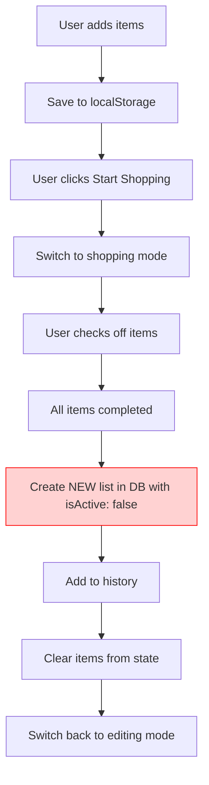
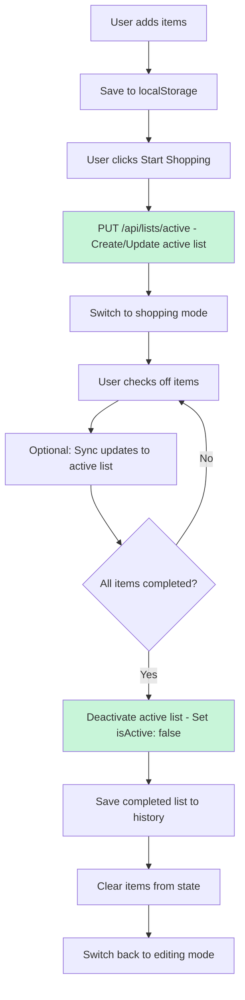

# Active List Management Fix

## Problem Statement

The current shopping list flow has a critical issue with active list management:

1. When a user creates a list and starts shopping, no active list is created in the database
2. When shopping is completed (all items checked off), a NEW list is saved to the database with `isActive: false`
3. The active list is never created, updated, or deactivated properly
4. This causes duplicate lists and incorrect active list state

## Root Cause Analysis

### Current Flow (BROKEN)



### Issues Identified

1. **No Active List Creation**: The `/api/lists/active` endpoint exists but is never used
2. **Duplicate List Creation**: Shopping completion creates a new list instead of deactivating the active one
3. **Missing Deactivation Logic**: Active lists are never set to `isActive: false`
4. **No Real-time Sync**: Item changes during shopping are not synced to database

## Proposed Solution

### Correct Flow (FIXED)



## Implementation Plan

### Phase 1: Update Lists API

**File**: `src/lib/lists-api.ts`

Add the following function to use the existing `/api/lists/active` endpoint:

```typescript
updateActive: async (items: ShoppingItem[]) => {
  const response = await apiClient.put("/api/lists/active", { items });
  return response.data;
};
```

### Phase 2: Update GroceryApp Component

**File**: `src/components/GroceryApp.tsx`

#### 2.1 Update `handleDone` Function (Start Shopping)

**Current behavior**: Only switches view mode

**New behavior**: Create/update active list in database before switching mode

```typescript
const handleDone = async () => {
  if (items.length === 0) {
    toast({
      title: "No Items",
      description: "Add some items to your list first!",
      variant: "destructive",
    });
    return;
  }

  // Save active list to database if user is authenticated
  if (user) {
    try {
      await listsApi.updateActive(items);
      toast({
        title: "Active List Saved",
        description: "Your shopping list is now active.",
      });
    } catch (error) {
      console.error("Failed to save active list:", error);
      // Continue anyway - localStorage is the backup
    }
  }

  // Switch to shopping mode
  setViewMode("shopping");
  setActiveTab("make-list");

  toast({
    title: "Ready to Shop!",
    description: "Your list is ready. Check off items as you shop.",
  });
};
```

#### 2.2 Update Shopping Completion Logic

**Current behavior**: Creates new list with `isActive: false`

**New behavior**: Deactivate existing active list

Locate the `useEffect` that handles shopping completion (around line 651) and update it:

```typescript
useEffect(() => {
  const allCompleted =
    items.length > 0 && items.every((item) => item.completed);

  if (
    allCompleted &&
    viewMode === "shopping" &&
    !completionProcessedRef.current
  ) {
    completionProcessedRef.current = true;

    setTimeout(async () => {
      playSuccessSound();

      // Deactivate active list in database if user is authenticated
      if (user) {
        try {
          // Get current active list
          const activeList = await listsApi.getActive();

          if (activeList) {
            // Deactivate the active list
            await listsApi.update(activeList.id, {
              isActive: false,
              items: [...items], // Save with completion status
            });
          }
        } catch (error) {
          console.error("Failed to deactivate active list:", error);
        }
      }

      // Save completed list to history (localStorage)
      const now = Date.now();
      const completedList: SavedList = {
        id: generateId(),
        items: [...items],
        createdAt: now,
        updatedAt: now,
      };

      // Save to localStorage
      setHistory((prev) => [completedList, ...prev.slice(0, 9)]);

      toast({
        title: "🎉 Shopping Complete!",
        description: "Congratulations! Your list has been saved to history.",
      });

      setTimeout(() => {
        toast({
          title: "🎊 Well Done! 🎊",
          description: "You've successfully completed your shopping list!",
          duration: 5000,
        });

        setTimeout(() => {
          setItems([]);
          setViewMode("editing");
          completionProcessedRef.current = false;
        }, 3000);
      }, 1000);
    }, 0);
  }
}, [items, viewMode, toast, user]);
```

### Phase 3: Optional Real-time Sync (Enhancement)

**File**: `src/components/GroceryApp.tsx`

Add a `useEffect` to sync item changes to the active list during shopping mode:

```typescript
// Sync item changes to active list during shopping mode
useEffect(() => {
  if (user && viewMode === "shopping" && items.length > 0) {
    const syncTimeout = setTimeout(async () => {
      try {
        await listsApi.updateActive(items);
      } catch (error) {
        console.error("Failed to sync active list:", error);
      }
    }, 1000); // Debounce sync to avoid excessive API calls

    return () => clearTimeout(syncTimeout);
  }
}, [items, viewMode, user]);
```

### Phase 4: Load Active List on App Start

**File**: `src/components/GroceryApp.tsx`

Add logic to load the active list when the app starts:

```typescript
// Load active list from database on component mount
useEffect(() => {
  if (user) {
    listsApi
      .getActive()
      .then((activeList) => {
        if (activeList && activeList.items && activeList.items.length > 0) {
          // Load active list items
          const resetItems = activeList.items.map((item: ShoppingItem) => ({
            ...item,
            completed: false, // Reset completion status for new shopping session
          }));
          setItems(resetItems);
          setEditingListId(activeList.id);
          toast({
            title: "Active List Loaded",
            description: "Your active shopping list has been loaded.",
          });
        }
      })
      .catch((error) => {
        console.error("Failed to load active list:", error);
      });
  }
}, [user]);
```

## Database Schema Verification

The current schema already supports the required functionality:

```prisma
model List {
  id        String   @id @default(cuid())
  userId    String
  user      User     @relation(fields: [userId], references: [id], onDelete: Cascade)
  name      String
  items     Json     // ShoppingItem[]
  isActive  Boolean  @default(false)  // ✅ Already exists
  createdAt DateTime @default(now())
  updatedAt DateTime @updatedAt
}
```

The `isActive` field is already present and the backend has the necessary endpoints.

## Backend Endpoints Verification

The backend already has all required endpoints:

1. `PUT /api/lists/active` - Creates or updates active list (lines 38-78)
2. `GET /api/lists/active` - Gets active list (lines 22-35)
3. `PUT /api/lists/:id` - Updates list (can set `isActive: false`) (lines 114-151)

No backend changes are required.

## Testing Checklist

- [ ] User adds items and clicks "Start Shopping" → Active list created in database
- [ ] Active list has `isActive: true`
- [ ] User checks off items → Items update in state
- [ ] All items completed → Active list deactivated (`isActive: false`)
- [ ] Completed list saved to history
- [ ] Items cleared from state
- [ ] User returns to app → Active list loaded (if exists)
- [ ] Multiple shopping sessions → Only one active list at a time
- [ ] Offline behavior → Graceful fallback to localStorage

## Edge Cases to Handle

1. **No Active List**: If no active list exists, create one on "Start Shopping"
2. **Multiple Active Lists**: Backend should ensure only one active list per user
3. **Network Errors**: Gracefully handle API failures and fall back to localStorage
4. **Unauthenticated Users**: Skip database operations, use localStorage only
5. **Empty Lists**: Don't create active list if items array is empty

## Migration Notes

This is a frontend-only change. No database migrations are required because:

1. The `isActive` field already exists in the schema
2. All required backend endpoints are already implemented
3. The change is in how the frontend uses these existing endpoints

## Success Criteria

- Active list is created when user starts shopping
- Active list is deactivated when shopping is completed
- Only one active list exists per user at any time
- Completed lists are saved to history with correct completion status
- Items are cleared from state after shopping completion
- Active list disappears from database (marked inactive) after completion
