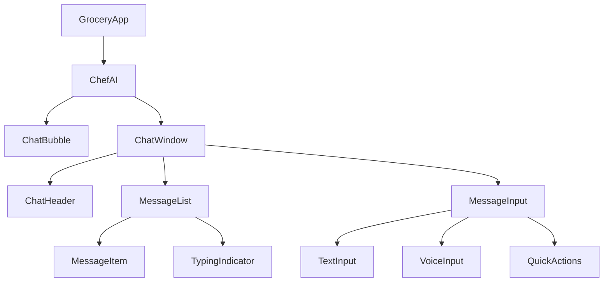
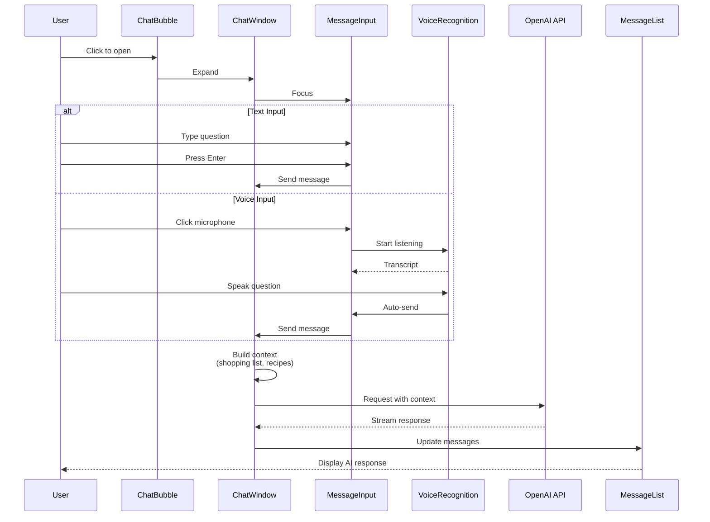
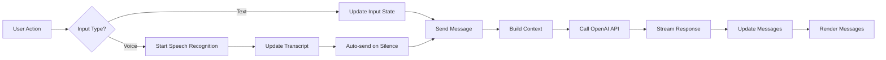
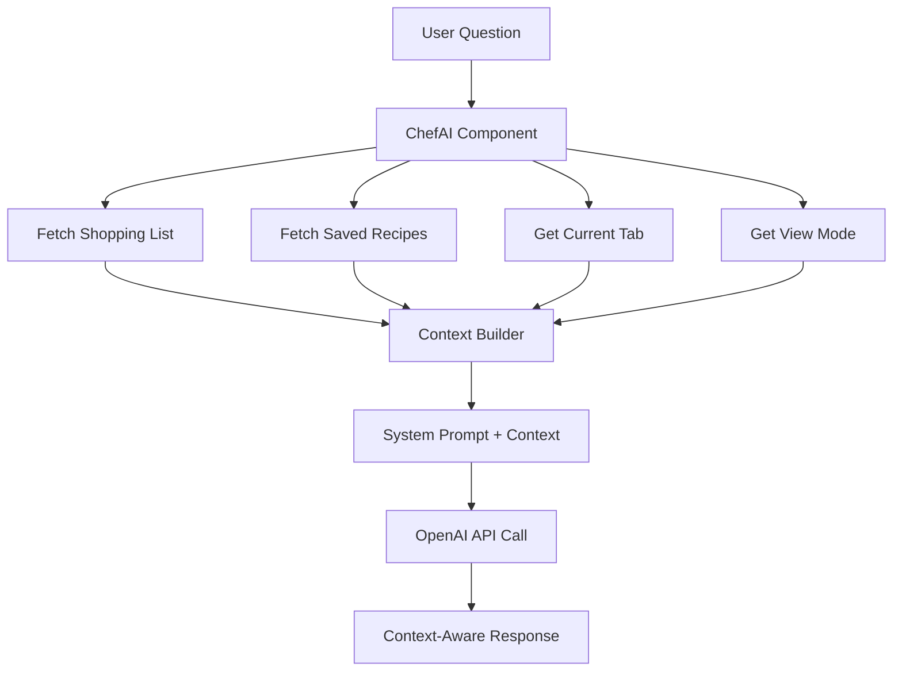
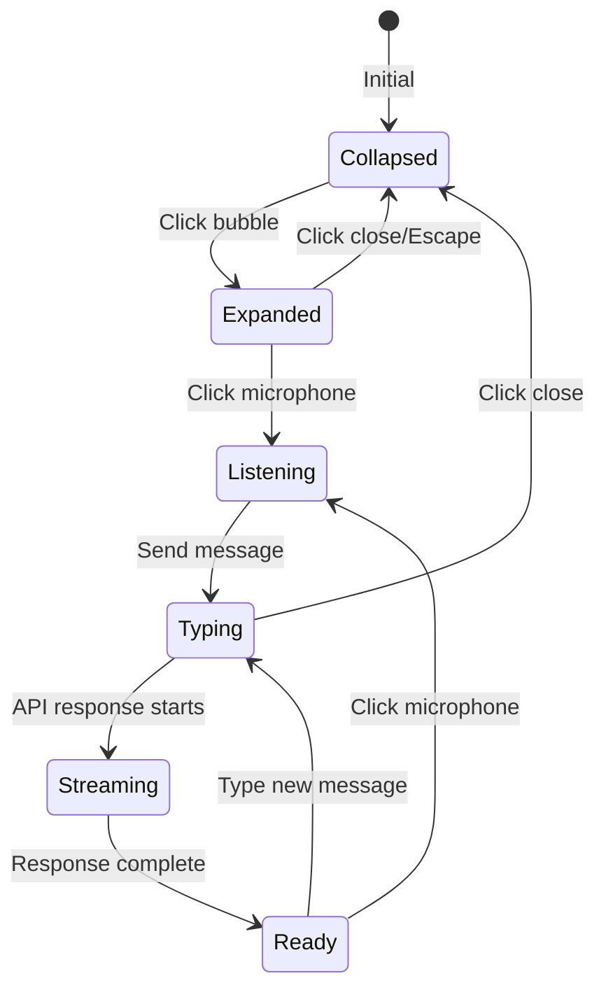
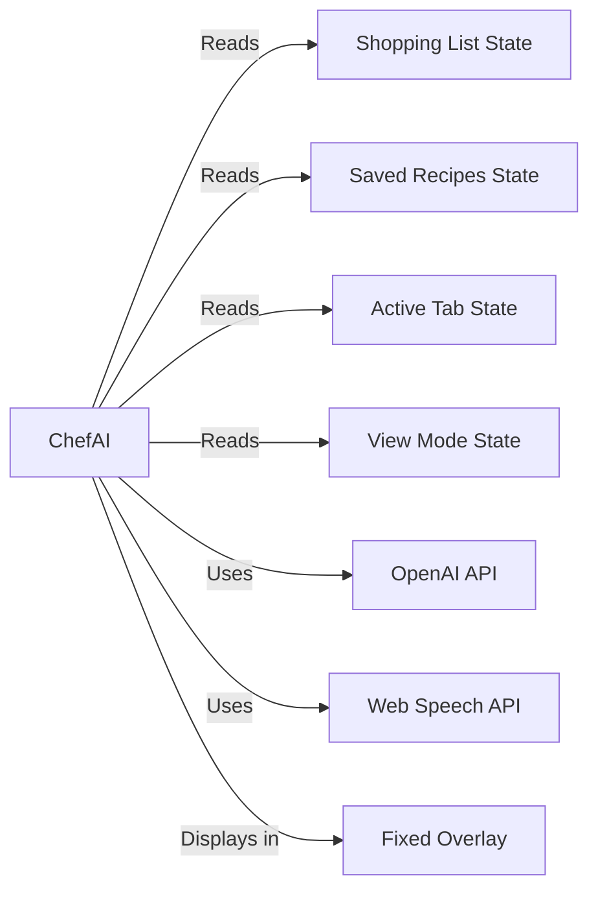
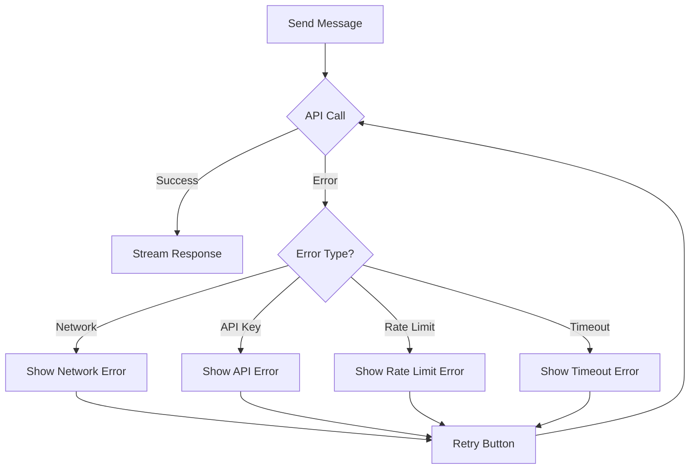
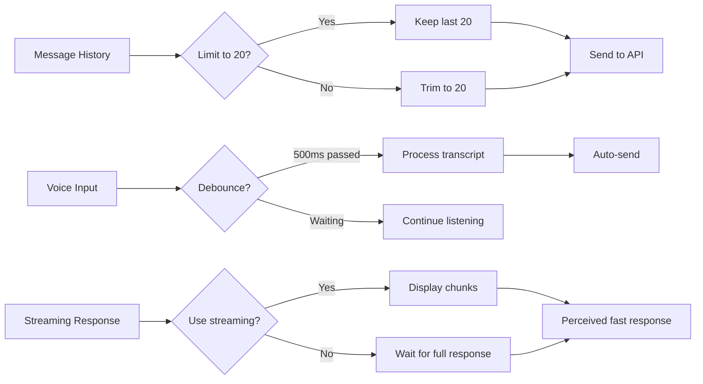
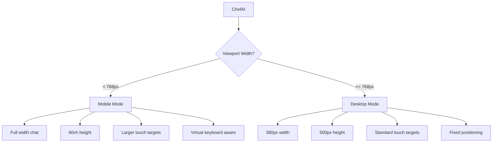

# ChefAI Architecture Diagram

## Component Hierarchy



## Data Flow Diagram



## State Management Flow



## Context Injection Flow



## Component State Flow



## File Structure

```
src/
├── components/
│   ├── ChefAI/
│   │   ├── ChefAI.tsx              # Main container (orchestrator)
│   │   ├── ChatBubble.tsx           # Floating button component
│   │   ├── ChatWindow.tsx           # Expandable chat interface
│   │   ├── ChatHeader.tsx           # Header with title + close
│   │   ├── MessageList.tsx          # Message history display
│   │   ├── MessageItem.tsx           # Individual message component
│   │   ├── TypingIndicator.tsx      # AI typing animation
│   │   ├── MessageInput.tsx         # Input field + voice toggle
│   │   ├── TextInput.tsx            # Text input component
│   │   ├── VoiceInput.tsx           # Voice input component
│   │   └── QuickActions.tsx         # Pre-built question buttons
│   └── GroceryApp.tsx              # Parent component
├── hooks/
│   ├── useChefAI.ts                 # Custom hook for ChefAI logic
│   └── useChefAIVoice.ts           # Voice recognition for ChefAI
├── lib/
│   ├── openai.ts                    # Extended with ChefAI functions
│   └── chefai-context.ts           # Context builder utilities
└── types/
    └── chefai.ts                   # TypeScript types for ChefAI
```

## Integration Points



## UI Layout

```
┌─────────────────────────────────────────────────────────┐
│                                                         │
│                   Main App Content                       │
│                  (GroceryApp)                           │
│                                                         │
│                                                         │
│                                                         │
└─────────────────────────────────────────────────────────┘
                                                    ┌─────────┐
                                                    │  👨‍🍳   │  ← ChatBubble
                                                    │ ChefAI  │  (collapsed)
                                                    └─────────┘

┌─────────────────────────────────────────────────────────┐
│                   Main App Content                       │
│                                                         │
│                                                         │
│                                                         │
│                                                         │
└─────────────────────────────────────────────────────────┘
                                                ┌──────────────────────┐
                                                │  👨‍🍳 ChefAI      │  ← ChatWindow
                                                ├──────────────────────┤  (expanded)
                                                │  [Messages]        │
                                                │                    │
                                                │  User: How do I   │
                                                │        cook rice?   │
                                                │                    │
                                                │  ChefAI: Here's    │
                                                │         how...      │
                                                │                    │
                                                │  [▓▓▓] typing    │
                                                ├──────────────────────┤
                                                │  [🎤] [input] [→] │
                                                └──────────────────────┘
```

## Key Features Mapping

| Feature             | Component       | Implementation                  |
| ------------------- | --------------- | ------------------------------- |
| Floating bubble     | ChatBubble      | Fixed position, bottom-right    |
| Expand/collapse     | ChatWindow      | State-based rendering           |
| Message history     | MessageList     | Array of messages, scrollable   |
| Text input          | TextInput       | Controlled input with Enter key |
| Voice input         | VoiceInput      | Web Speech API integration      |
| Voice toggle        | MessageInput    | Button to switch modes          |
| Typing indicator    | TypingIndicator | Animation component             |
| Quick actions       | QuickActions    | Pre-defined questions           |
| Context awareness   | ChefAI          | Props from GroceryApp           |
| Streaming responses | ChefAI          | OpenAI streaming API            |
| Keyboard shortcuts  | ChefAI          | useEffect with keydown listener |
| Mobile responsive   | All components  | Tailwind responsive classes     |
| Accessibility       | All components  | ARIA labels, focus management   |

## API Interaction

```mermaid
sequenceDiagram
    participant C as ChefAI Component
    participant O as OpenAI API
    participant U as User

    C->>O: POST /chat/completions
    Note over C,O: {
      model: "gpt-4o-mini",
      messages: [
        {role: "system", content: "You are ChefAI..."},
        {role: "user", content: "How do I cook rice?"}
      ],
      stream: true
    }

    O-->>C: chunk 1: "To cook"
    C->>U: Display "To cook"
    O-->>C: chunk 2: " rice perfectly,"
    C->>U: Append " rice perfectly,"
    O-->>C: chunk 3: " follow these..."
    C->>U: Append " follow these..."
    O-->>C: [DONE]
    C->>U: Complete message
```

## Error Handling Flow



## Performance Optimization



## Mobile vs Desktop


