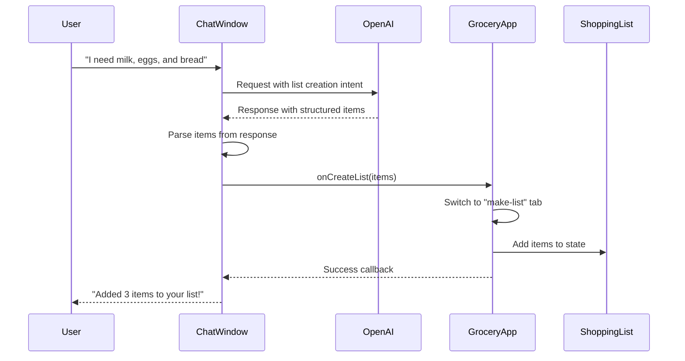

# ChefAI List Creation Feature

## Overview

Enable ChefAI to create shopping lists for users. Users can tell ChefAI what they need, and ChefAI will:

1. Parse the user's request
2. Extract grocery items from the request
3. Switch to the "Make a List" tab
4. Add items to the shopping list
5. Provide confirmation to the user

## User Flow



## Architecture

### Component Hierarchy

```
GroceryApp
├── ChefAI
│   ├── ChatBubble
│   └── ChatWindow
│       ├── MessageList
│       ├── MessageInput
│       └── QuickActions
└── ShoppingList (receives items)
```

### Data Flow

```
User Request
    ↓
ChefAI ChatWindow
    ↓
OpenAI API (with list creation prompt)
    ↓
AI Response (structured JSON or natural language)
    ↓
Parse Items Function
    ↓
Callback to GroceryApp
    ↓
Update items state
    ↓
Switch to make-list tab
    ↓
Show toast notification
```

## Implementation Plan

### Phase 1: Type Definitions

**File: `src/types/chefai.ts`**

Add new types for list creation:

```typescript
export interface ListCreationItem {
  name: string;
  quantity?: number;
  unit?: string;
}

export interface ListCreationAction {
  type: 'create_list';
  items: ListCreationItem[];
  clearExisting?: boolean;
}

export interface ChefAIProps {
  shoppingList: Array<{...}>;
  savedRecipes: Array<{...}>;
  currentTab: string;
  viewMode: 'editing' | 'shopping';
  // NEW: Callback for list creation
  onCreateList?: (items: ListCreationItem[], clearExisting?: boolean) => void;
}
```

### Phase 2: OpenAI System Prompt Update

**File: `src/lib/openai.ts`**

Update `buildChefAISystemPrompt` to include list creation instructions:

```typescript
function buildChefAISystemPrompt(context: ChefAIContext): string {
  const shoppingListItems =
    context.shoppingList
      .filter((item) => !item.completed)
      .map((item) => {
        const qty = item.quantity ? `${item.quantity} ` : "";
        const unit = item.unit ? `${item.unit} ` : "";
        return `${qty}${unit}${item.name}`;
      })
      .join(", ") || "none";

  const recipeNames =
    context.savedRecipes.map((recipe) => recipe.name).join(", ") || "none";

  return `You are ChefAI, a helpful cooking assistant for SousChefy app.

Your role:
- Provide cooking advice, tips, and techniques
- Suggest recipes based on available ingredients
- Answer kitchen-related questions
- Help with meal planning and preparation
- Explain cooking methods and terminology
- **CREATE SHOPPING LISTS**: When user asks to create a list, extract items and respond with structured JSON

Context awareness:
- You have access to user's shopping list items
- You have access to user's saved recipes
- Use this information to provide personalized suggestions

Current context:
Shopping list items: ${shoppingListItems}
Saved recipes: ${recipeNames}
Current view: ${context.currentTab} (${context.viewMode})

Guidelines:
- Keep responses concise and practical (2-4 paragraphs max)
- Use clear, step-by-step instructions when giving directions
- Suggest alternatives when ingredients are missing
- Be encouraging and supportive
- If you don't know something, admit it honestly
- When suggesting recipes, consider items in shopping list
- Format recipes clearly with bullet points or numbered lists
- For ingredient substitutions, explain why the substitution works

**LIST CREATION INSTRUCTIONS**:
When user asks to create a shopping list (e.g., "I need milk, eggs, and bread", "Create a list for pasta dinner", "Make a shopping list"):
1. Extract all grocery items from the request
2. Parse quantities and units if specified
3. Respond with JSON format in a code block:
\`\`\`json
{
  "type": "create_list",
  "items": [
    {"name": "Milk", "quantity": 1, "unit": "gallon"},
    {"name": "Eggs", "quantity": 12, "unit": "dozen"},
    {"name": "Bread"}
  ],
  "clearExisting": false
}
\`\`\`
4. After the JSON, provide a brief friendly message confirming what was added
5. Set "clearExisting": true only if user explicitly says to "replace" or "start fresh"`;
}
```

### Phase 3: ChefAI Component Update

**File: `src/components/ChefAI/ChefAI.tsx`**

Add callback prop and pass to ChatWindow:

```typescript
export const ChefAI: React.FC<ChefAIProps> = ({
  shoppingList,
  savedRecipes,
  currentTab,
  viewMode,
  onCreateList // NEW
}) => {
  // ... existing code ...

  return (
    <>
      <ChatBubble ... />
      <ChatWindow
        isOpen={isOpen}
        onClose={handleClose}
        context={context}
        onCreateList={onCreateList} // NEW
      />
    </>
  );
};
```

### Phase 4: ChatWindow List Creation Parser

**File: `src/components/ChefAI/ChatWindow.tsx`**

Add list creation detection and parsing:

````typescript
import type { ListCreationItem, ListCreationAction } from "@/types/chefai";

interface ChatWindowProps {
  isOpen: boolean;
  onClose: () => void;
  context: ChefAIContext;
  onCreateList?: (items: ListCreationItem[], clearExisting?: boolean) => void; // NEW
}

// Function to parse list creation from AI response
const parseListCreation = (response: string): ListCreationAction | null => {
  // Look for JSON code block
  const jsonMatch = response.match(/```json\s*([\s\S]*?)\s*```/);
  if (!jsonMatch) return null;

  try {
    const data = JSON.parse(jsonMatch[1]);

    // Validate structure
    if (data.type === "create_list" && Array.isArray(data.items)) {
      return {
        type: "create_list",
        items: data.items.map((item: any) => ({
          name: item.name,
          quantity: item.quantity,
          unit: item.unit,
        })),
        clearExisting: data.clearExisting || false,
      };
    }
  } catch (error) {
    console.error("Failed to parse list creation JSON:", error);
  }

  return null;
};

// Update handleSendMessage to detect list creation
const handleSendMessage = useCallback(
  async (message: string) => {
    // ... existing code ...

    let aiResponse = "";
    let listCreationAction: ListCreationAction | null = null;

    await askChefAI(
      message,
      context,
      messages,
      (chunk) => {
        aiResponse += chunk;
        // Update messages as before...
      },
      (error) => {
        // Error handling...
      },
    );

    // After streaming completes, check for list creation
    const listAction = parseListCreation(aiResponse);
    if (listAction && onCreateList) {
      onCreateList(listAction.items, listAction.clearExisting);
    }

    // Keep only last 20 messages
    setMessages((prev) => prev.slice(-20));
  },
  [context, messages, toast, onCreateList],
); // Add onCreateList to deps
````

### Phase 5: GroceryApp Integration

**File: `src/components/GroceryApp.tsx`**

Add list creation handler:

```typescript
import type { ListCreationItem } from '@/types/chefai';

// Handler for ChefAI list creation
const handleCreateListFromChefAI = useCallback((items: ListCreationItem[], clearExisting?: boolean) => {
  if (clearExisting) {
    // Clear existing list
    setItems([]);
  }

  // Convert to ShoppingItem format
  const newItems: ShoppingItem[] = items.map(item => {
    // Find best match in database
    const bestMatch = findBestMatch(item.name);
    const displayName = bestMatch || item.name;

    return {
      id: Math.random().toString(36).substr(2, 9),
      name: displayName.charAt(0).toUpperCase() + displayName.slice(1),
      completed: false,
      quantity: item.quantity,
      unit: item.unit
    };
  });

  // Add items to list (filtering duplicates)
  setItems(prevItems => {
    const itemsToAdd = newItems.filter(newItem =>
      !prevItems.some(existing => existing.name.toLowerCase() === newItem.name.toLowerCase())
    );

    if (itemsToAdd.length > 0) {
      setTimeout(() => {
        toast({
          title: `Added ${itemsToAdd.length} item${itemsToAdd.length > 1 ? "s" : ""}`,
          description: itemsToAdd.map(item =>
            item.quantity ? `${item.quantity}${item.unit ? ` ${item.unit} ` : ' '}${item.name}` : item.name
          ).join(", "),
        });
      }, 0);
    }

    return [...prevItems, ...itemsToAdd];
  });

  // Switch to make-list tab
  setActiveTab('make-list');
  setViewMode('editing');
}, [toast]);

// Update ChefAI component usage
<ChefAI
  shoppingList={items}
  savedRecipes={savedRecipes}
  currentTab={activeTab}
  viewMode={viewMode}
  onCreateList={handleCreateListFromChefAI}
/>
```

### Phase 6: Quick Actions Update

**File: `src/components/ChefAI/QuickActions.tsx`**

Add quick action for list creation:

```typescript
const quickActions: QuickAction[] = [
  {
    id: 'what-can-i-cook',
    label: 'What can I cook?',
    question: 'What can I cook with ingredients in my shopping list?',
    icon: <ChefHat className="w-4 h-4" />
  },
  {
    id: 'create-list',
    label: 'Create a list',
    question: 'Help me create a shopping list for a week of meals',
    icon: <ShoppingCart className="w-4 h-4" />
  },
  // ... other actions
];
```

## Edge Cases & Considerations

### 1. Duplicate Items

- When ChefAI adds items, check for duplicates (case-insensitive)
- Only add items that don't already exist in the list
- Show toast with count of items actually added

### 2. Clear vs Append

- Default behavior: Append to existing list
- User can explicitly say "replace" or "start fresh" to clear first
- AI should detect intent and set `clearExisting` flag

### 3. Quantity Parsing

- Support various quantity formats:
  - Numbers: "2 apples", "1 gallon of milk"
  - Words: "a dozen eggs", "a loaf of bread"
  - Implicit: "apples" (no quantity = undefined)

### 4. Item Validation

- Use existing `findBestMatch()` to match against grocery database
- Fall back to user-provided name if no match found
- Capitalize first letter of item names

### 5. Error Handling

- If JSON parsing fails, show error toast
- If onCreateList callback not provided, log warning
- If items array is empty, show warning toast

### 6. User Feedback

- Show toast notification when items are added
- Display count of items added
- List the items that were added
- Switch to make-list tab automatically

## Testing Scenarios

### Scenario 1: Simple List Creation

**User**: "I need milk, eggs, and bread"
**Expected**: ChefAI adds 3 items, switches to list tab, shows confirmation

### Scenario 2: List with Quantities

**User**: "I need 2 gallons of milk, a dozen eggs, and 1 loaf of bread"
**Expected**: Items added with correct quantities and units

### Scenario 3: Replace Existing List

**User**: "Replace my list with pasta ingredients: spaghetti, tomato sauce, parmesan cheese"
**Expected**: Existing list cleared, 3 new items added

### Scenario 4: Append to Existing List

**User**: "Add butter and cheese to my list"
**Expected**: Items added to existing list without clearing

### Scenario 5: Recipe-Based List

**User**: "Create a shopping list for chicken stir-fry dinner"
**Expected**: ChefAI suggests ingredients for the recipe and adds them

### Scenario 6: Meal Planning

**User**: "Help me create a shopping list for a week of meals"
**Expected**: ChefAI suggests variety of items for multiple meals

### Scenario 7: Duplicate Detection

**User**: "Add milk" (when milk already in list)
**Expected**: Toast shows "Item already exists", no duplicate added

### Scenario 8: Invalid JSON

**AI Response**: Malformed JSON
**Expected**: Error toast shown, no items added

## UI Improvements

### 1. Success Animation

- Show brief animation when items are added
- Highlight the shopping list tab briefly

### 2. Item Count Badge

- Update the list tab badge when items are added
- Show total count of items in list

### 3. Scroll to Items

- Automatically scroll to shopping list when items are added
- Focus on the newly added items

### 4. Confirmation Dialog (Optional)

- For large lists (>10 items), show confirmation dialog
- Allow user to review before adding

## Performance Considerations

1. **Debounce List Creation**: Don't create lists on every AI response
2. **Limit Items**: Cap at 50 items per ChefAI request
3. **Optimize Parsing**: Use efficient JSON parsing
4. **Memoize Callbacks**: Use useCallback for handlers

## Security Considerations

1. **Input Validation**: Validate all item names and quantities
2. **Sanitize JSON**: Ensure parsed JSON is safe
3. **Rate Limiting**: Limit list creation frequency (optional)
4. **User Consent**: Always show what was added

## Future Enhancements

1. **Edit Items**: Allow ChefAI to modify existing items
2. **Remove Items**: Allow ChefAI to remove specific items
3. **Smart Suggestions**: Suggest items based on recipes
4. **Meal Plans**: Generate weekly meal plans with shopping lists
5. **Budget Tracking**: Estimate costs for generated lists
6. **Dietary Preferences**: Filter items based on user preferences
7. **Store Integration**: Check store inventory before adding items

## Success Metrics

1. **Usage Rate**: Percentage of users who use list creation
2. **Accuracy**: Percentage of correctly parsed items
3. **User Satisfaction**: Feedback on list quality
4. **Time Saved**: Comparison to manual list creation
5. **Error Rate**: Failed list creation attempts

## Implementation Checklist

- [x] Analyze existing ChefAI and GroceryApp architecture
- [x] Design list creation flow for ChefAI
- [ ] Update TypeScript types for list creation actions
- [ ] Extend OpenAI system prompt to handle list creation requests
- [ ] Add callback props to ChefAI component for list manipulation
- [ ] Implement list creation parser in ChatWindow
- [ ] Add quick action button for creating lists
- [ ] Update GroceryApp to handle list creation from ChefAI
- [ ] Test list creation flow end-to-end
- [ ] Update documentation

## Files to Modify

1. `src/types/chefai.ts` - Add list creation types
2. `src/lib/openai.ts` - Update system prompt
3. `src/components/ChefAI/ChefAI.tsx` - Add callback prop
4. `src/components/ChefAI/ChatWindow.tsx` - Add parser logic
5. `src/components/ChefAI/QuickActions.tsx` - Add quick action
6. `src/components/GroceryApp.tsx` - Add handler and integration

## Estimated Complexity

- **Low**: Type definitions, QuickActions update
- **Medium**: System prompt update, ChefAI prop passing
- **High**: List creation parser, GroceryApp integration

## Dependencies

No new dependencies required. Uses existing:

- OpenAI API
- React hooks (useState, useCallback, useEffect)
- shadcn/ui components
- Lucide React icons
