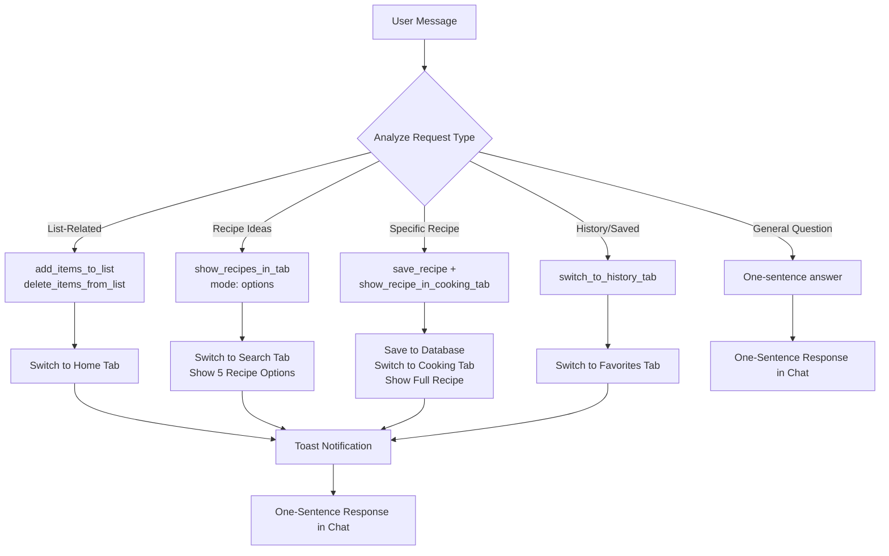
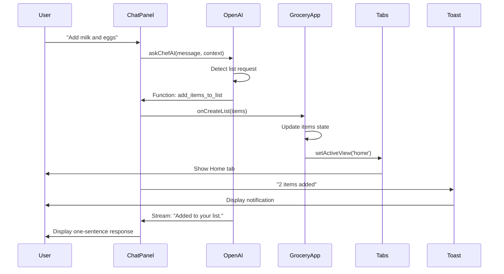
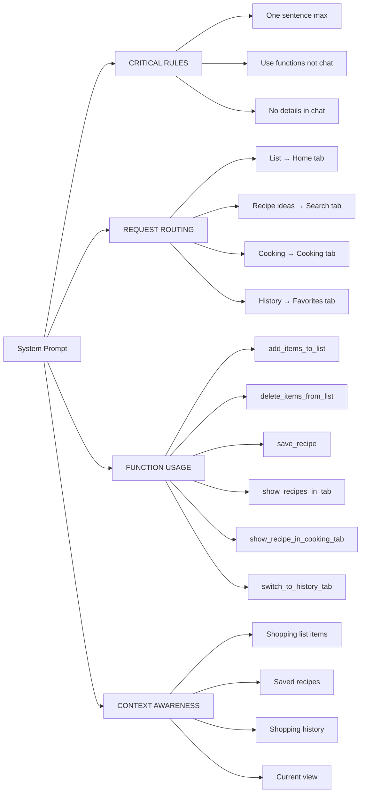
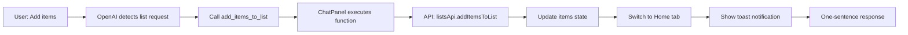
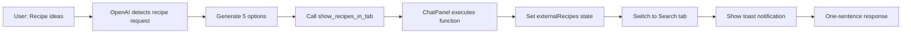

# ChefAI Behavior Flowchart

## Request Type Detection & Routing



## Tab Routing Matrix

| Request Type           | Function Called                              | Target Tab | Chat Response                      | Content Location |
| ---------------------- | -------------------------------------------- | ---------- | ---------------------------------- | ---------------- |
| Add items to list      | `add_items_to_list`                          | Home       | "Added to your list."              | Home tab items   |
| Remove items from list | `delete_items_from_list`                     | Home       | "Removed from list."               | Home tab items   |
| Create shopping list   | `add_items_to_list`                          | Home       | "List created."                    | Home tab items   |
| Recipe ideas           | `show_recipes_in_tab` (options)              | Search     | "Check Recipe tab."                | Recipe tab cards |
| Specific recipe        | `save_recipe` + `show_recipe_in_cooking_tab` | Cooking    | "Recipe saved. Check Cooking tab." | Cooking mode     |
| Show history           | `switch_to_history_tab`                      | Favorites  | "Check History tab."               | History tab      |
| Show saved recipes     | `switch_to_history_tab`                      | Favorites  | "Check History tab."               | History tab      |
| Cooking question       | None                                         | None       | One-sentence answer                | Chat only        |

## Component Interaction Diagram



## System Prompt Structure



## Response Length Examples

### ❌ OLD BEHAVIOR (Multi-paragraph)

```
I've added 3 items to your shopping list: milk, eggs, and bread.
These items have been successfully added to your active shopping list.
You can view them in the Make a List tab.
Let me know if you need anything else!
```

### ✅ NEW BEHAVIOR (One sentence)

```
Added to your list.
```

### ❌ OLD BEHAVIOR (Detailed recipe)

```
Here's a lasagna recipe:

Ingredients:
- 1 lb ground beef
- 1 onion, chopped
- 2 cloves garlic, minced
- 24 oz marinara sauce
- 15 oz ricotta cheese
- 2 cups mozzarella cheese
- 1/2 cup parmesan cheese
- 12 lasagna noodles

Instructions:
1. Preheat oven to 375°F
2. Cook lasagna noodles according to package
3. Brown ground beef with onion and garlic
4. Layer noodles, meat sauce, and cheese mixture
5. Bake for 45 minutes
6. Let rest for 10 minutes before serving

I've saved this recipe to your collection!
```

### ✅ NEW BEHAVIOR (One sentence + tab)

```
Recipe saved. Check Cooking tab.
```

## Function Call Flow

### List Operations



### Recipe Operations



### Cooking Operations

```mermaid
flowchart LR
    A[User: Specific recipe] --> B[OpenAI detects cooking request]
    B --> C[Generate full recipe]
    C --> D[Call save_recipe]
    D --> E[Call show_recipe_in_cooking_tab]
    E --> F[ChatPanel executes functions]
    F --> G[API: recipesApi.create]
    G --> H[Set selectedCookingRecipe]
    H --> I[Switch to Cooking tab]
    I --> J[Show toast notification]
    J --> K[One-sentence response]
```



## State Changes

### Home Tab (List)

```typescript
// Before
activeView: 'home'
items: [existing items]

// After ChefAI adds items
activeView: 'home' (stays)
items: [existing items, milk, eggs, bread]
toast: "3 items added"
chat: "Added to your list."
```

### Search Tab (Recipes)

```typescript
// Before
activeView: 'search'
externalRecipes: null

// After ChefAI shows options
activeView: 'search' (stays)
externalRecipes: [5 recipe options]
externalRecipeMode: 'options'
toast: "5 recipe suggestions found"
chat: "Check Recipe tab."
```

### Cooking Tab

```typescript
// Before
activeView: 'cooking'
selectedCookingRecipe: null

// After ChefAI saves recipe
activeView: 'cooking'
selectedCookingRecipe: {full recipe object}
savedRecipes: [existing, new recipe]
toast: "Recipe saved. Ready to cook."
chat: "Recipe saved. Check Cooking tab."
```

### Favorites Tab (History)

```typescript
// Before
activeView: "favorites";

// After ChefAI switches to history
activeView: "favorites";
toast: "Check your saved lists and recipes.";
chat: "Check History tab.";
```
