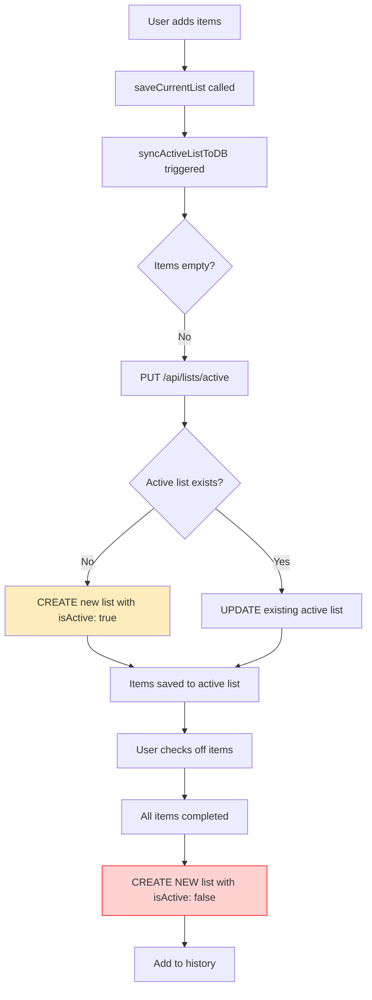

# Fix Duplicate Lists Issue

## Problem Statement

Users are experiencing duplicate lists in the database:

- One list with `isActive: true`
- Another list with `isActive: false`

This happens when a shopping list is completed.

## Root Cause Analysis

### Current Flow (PROBLEMATIC)



### The Issue

1. **Background Sync Creates Active List**: Every time `items` changes, `saveCurrentList()` triggers `syncActiveListToDB()` which creates/updates an active list with `isActive: true`

2. **Completion Creates New List**: When shopping is complete, the code creates a NEW list with `isActive: false` (GroceryApp.tsx lines 664-668)

3. **Active List Never Deactivated**: The original active list with `isActive: true` is never deactivated, leaving TWO lists in the database

### Code Locations

**File: `src/lib/storage.ts` (lines 78-130)**

```typescript
async function syncActiveListToDB(items: ShoppingItem[]): Promise<void> {
  // ... deletes empty lists ...
  // Syncs non-empty list
  const response = await fetch(`${API_BASE_URL}/api/lists/active`, {
    method: "PUT",
    headers: {
      "Content-Type": "application/json",
      Authorization: `Bearer ${token}`,
    },
    body: JSON.stringify({ items }),
  });
}
```

**File: `src/components/GroceryApp.tsx` (lines 149-151)**

```typescript
// Save current list to localStorage whenever items change
useEffect(() => {
  saveCurrentList(items); // This triggers syncActiveListToDB
}, [items]);
```

**File: `src/components/GroceryApp.tsx` (lines 661-694)**

```typescript
// When shopping is complete
const dbList = await listsApi.create({
  name: `Shopping List - ${new Date(now).toLocaleDateString()}`,
  items: [...items],
  isActive: false, // Creates NEW list instead of deactivating active one
});
```

## Solution

### Approach 1: Deactivate Active List (RECOMMENDED)

Instead of creating a new list when shopping is complete, deactivate the existing active list.

#### Changes Required

**File: `src/components/GroceryApp.tsx`**

Update the shopping completion `useEffect` (around line 651):

```typescript
useEffect(() => {
  const allCompleted =
    items.length > 0 && items.every((item) => item.completed);

  if (
    allCompleted &&
    viewMode === "shopping" &&
    !completionProcessedRef.current
  ) {
    completionProcessedRef.current = true;

    setTimeout(async () => {
      playSuccessSound();

      // Save completed list to database when shopping is done
      if (user) {
        try {
          const now = Date.now();

          // Get current active list
          const activeList = await listsApi.getActive();

          if (activeList) {
            // Deactivate the active list instead of creating a new one
            await listsApi.update(activeList.id, {
              isActive: false,
              items: [...items], // Save with completion status
              name: activeList.name, // Keep original name
            });

            // Save to history (localStorage) with database ID
            const completedList: SavedList = {
              id: activeList.id,
              items: [...items],
              createdAt: new Date(activeList.createdAt).getTime(),
              updatedAt: now,
            };

            // Save to localStorage
            setHistory((prev) => [completedList, ...prev.slice(0, 9)]);
          } else {
            // Fallback: Create new list if no active list exists
            const dbList = await listsApi.create({
              name: `Shopping List - ${new Date(now).toLocaleDateString()}`,
              items: [...items],
              isActive: false,
            });

            const completedList: SavedList = {
              id: dbList.id,
              items: [...items],
              createdAt: now,
              updatedAt: now,
            };

            setHistory((prev) => [completedList, ...prev.slice(0, 9)]);
          }
        } catch (error) {
          console.error("Failed to save list to database:", error);

          // Fallback to localStorage only
          const now = Date.now();
          const completedList: SavedList = {
            id: generateId(),
            items: [...items],
            createdAt: now,
            updatedAt: now,
          };

          setHistory((prev) => [completedList, ...prev.slice(0, 9)]);
        }
      } else {
        // Unauthenticated user - save to localStorage only
        const now = Date.now();
        const completedList: SavedList = {
          id: generateId(),
          items: [...items],
          createdAt: now,
          updatedAt: now,
        };

        setHistory((prev) => [completedList, ...prev.slice(0, 9)]);
      }

      toast({
        title: "🎉 Shopping Complete!",
        description: "Congratulations! Your list has been saved to history.",
      });

      setTimeout(() => {
        toast({
          title: "🎊 Well Done! 🎊",
          description: "You've successfully completed your shopping list!",
          duration: 5000,
        });

        setTimeout(() => {
          setItems([]);
          setViewMode("editing");
          completionProcessedRef.current = false;
        }, 3000);
      }, 1000);
    }, 0);
  }
}, [items, viewMode, toast, user]);
```

### Approach 2: Disable Background Sync (ALTERNATIVE)

Disable the background sync that creates active lists, and only sync when explicitly needed.

#### Changes Required

**File: `src/lib/storage.ts`**

Update `saveCurrentList` function (line 18):

```typescript
export const saveCurrentList = (items: ShoppingItem[]): void => {
  try {
    localStorage.setItem(STORAGE_KEYS.CURRENT_LIST, JSON.stringify(items));
    // DISABLED: Background sync to database
    // syncActiveListToDB(items).catch(console.error);
  } catch (error) {
    console.error("Failed to save current list to localStorage:", error);
  }
};
```

Then add explicit sync functions:

```typescript
/**
 * Sync current list to database (explicit call)
 */
export async function syncCurrentListToDB(
  items: ShoppingItem[],
): Promise<void> {
  if (!isAuthenticated()) return;

  try {
    await syncActiveListToDB(items);
  } catch (error) {
    console.error("Failed to sync current list to database:", error);
  }
}
```

**File: `src/components/GroceryApp.tsx`**

Add explicit sync when starting shopping (in `handleDone`):

```typescript
const handleDone = async () => {
  if (items.length === 0) {
    toast({
      title: "No Items",
      description: "Add some items to your list first!",
      variant: "destructive",
    });
    return;
  }

  // Sync to database when starting shopping
  if (user) {
    try {
      await syncCurrentListToDB(items);
    } catch (error) {
      console.error("Failed to sync list:", error);
    }
  }

  // Switch to shopping mode
  setViewMode("shopping");
  setActiveTab("make-list");

  toast({
    title: "Ready to Shop!",
    description: "Your list is ready. Check off items as you shop.",
  });
};
```

### Approach 3: Delete Active List After Completion (SIMPLEST)

After deactivating the active list, delete it from the database to prevent accumulation.

#### Changes Required

Same as Approach 1, but add deletion:

```typescript
if (activeList) {
  // Deactivate the active list
  await listsApi.update(activeList.id, {
    isActive: false,
    items: [...items],
    name: activeList.name,
  });

  // Delete the active list from database
  await listsApi.delete(activeList.id);

  // Create new completed list
  const dbList = await listsApi.create({
    name: `Shopping List - ${new Date(now).toLocaleDateString()}`,
    items: [...items],
    isActive: false,
  });

  // ... rest of code
}
```

## Recommendation

**Use Approach 1 (Deactivate Active List)** because:

1. ✅ Preserves list history with correct IDs
2. ✅ Maintains continuity between active and completed lists
3. ✅ Minimal code changes
4. ✅ No data loss
5. ✅ Follows the existing database schema design

## Testing Checklist

- [ ] User adds items → Active list created in background sync
- [ ] User starts shopping → Active list exists with `isActive: true`
- [ ] User completes shopping → Active list deactivated to `isActive: false`
- [ ] Only ONE list exists in database (no duplicates)
- [ ] Completed list appears in history
- [ ] List ID remains consistent
- [ ] Offline behavior works (falls back to localStorage)
- [ ] Multiple shopping sessions don't create duplicates

## Files to Modify

1. `src/components/GroceryApp.tsx` - Update shopping completion logic
2. Optional: `src/lib/storage.ts` - If using Approach 2

## Backend Changes Required

None - all necessary endpoints already exist:

- `GET /api/lists/active` - Get active list
- `PUT /api/lists/:id` - Update list (set `isActive: false`)
