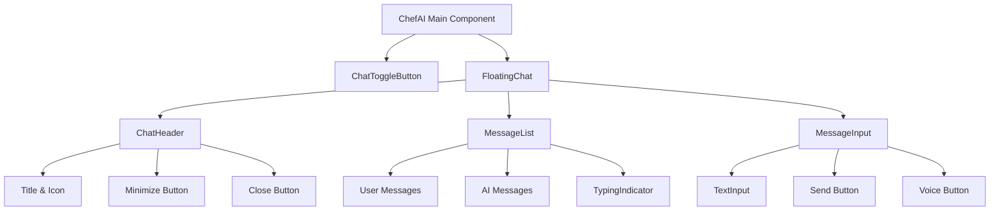
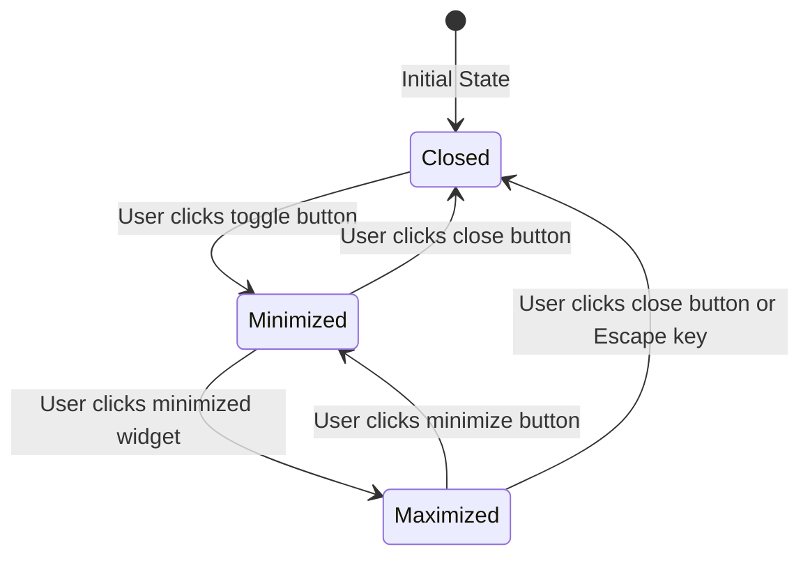
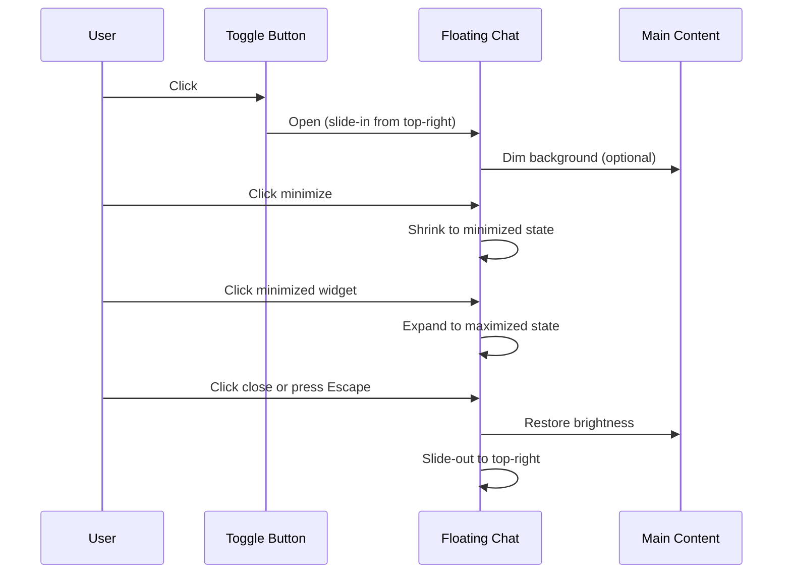

# ChefAI Floating Chat - Architecture Diagram

## Component Hierarchy



## State Flow



## UI Layout - Desktop

```
┌─────────────────────────────────────────────────────────────┐
│  ┌──────────┐                                            │
│  │ Toggle   │  Header: Hi user, welcome!                 │
│  │ Button   │                                            │
│  │ (Chef)   │  Main Content Area                          │
│  └──────────┘                                            │
│                                                         │
│                                                         │
│                                                         │
│                                                         │
│                                                         │
└─────────────────────────────────────────────────────────────┘

When Chat is OPEN (Maximized):

┌─────────────────────────────────────────────────────────────┐
│  ┌──────────┐                                            │
│  │ Toggle   │  Header: Hi user, welcome!                 │
│  │ Button   │                                            │
│  │ (Active) │  Main Content Area                          │
│  └──────────┘                                            │
│                                                         │
│  ┌────────────────────────────────────────────────────┐    │
│  │ ┌──────────────────────────────────────────────┐ │    │
│  │ │ ChefAI                        [−] [×]      │ │    │
│  │ ├──────────────────────────────────────────────┤ │    │
│  │ │                                              │ │    │
│  │ │  AI: Hi! How can I help you today?         │ │    │
│  │ │                                              │ │    │
│  │ │  User: I need milk and eggs                 │ │    │
│  │ │                                              │ │    │
│  │ │  AI: I've added milk and eggs...            │ │    │
│  │ │                                              │ │    │
│  │ │  [Typing...]                                │ │    │
│  │ │                                              │ │    │
│  │ └──────────────────────────────────────────────┘ │    │
│  │ ┌──────────────────────────────────────────────┐ │    │
│  │ │ Type a message...                    [Send] │ │    │
│  │ └──────────────────────────────────────────────┘ │    │
│  └────────────────────────────────────────────────────┘    │
│                                                         │
└─────────────────────────────────────────────────────────────┘
```

## UI Layout - Mobile

```
When Chat is OPEN (Maximized):

┌──────────────────────────────────┐
│  ┌────┐                        │
│  │Chef│  Header                │
│  └────┘                        │
├──────────────────────────────────┤
│                                │
│  Main Content Area             │
│                                │
│                                │
│                                │
│                                │
├──────────────────────────────────┤
│  ┌──────────────────────────┐  │
│  │ ChefAI          [−] [×] │  │
│  ├──────────────────────────┤  │
│  │                          │  │
│  │ AI: Hi! How can I...    │  │
│  │                          │  │
│  │ User: I need milk...     │  │
│  │                          │  │
│  │ AI: I've added...       │  │
│  │                          │  │
│  │ [Typing...]             │  │
│  │                          │  │
│  ├──────────────────────────┤  │
│  │ Type...           [Send] │  │
│  └──────────────────────────┘  │
│                                │
└──────────────────────────────────┘
```

## Animation Flow



## Responsive Breakpoints

```
Desktop (>768px):
- Toggle Button: 48x48px, top-right (padding: 20px)
- Chat Window: 380x500px, top-right (margin: 20px)
- Animation: Slide-in from top-right

Tablet (768px - 1024px):
- Toggle Button: 44x44px, top-right (padding: 16px)
- Chat Window: 320x450px, top-right (margin: 16px)
- Animation: Slide-in from top-right

Mobile (≤768px):
- Toggle Button: 40x40px, top-right (padding: 12px)
- Chat Window: Full width - 24px, 80vh, top-right (margin: 12px)
- Animation: Slide-up from bottom
```

## CSS Transitions

```css
/* Slide-in from top-right */
@keyframes slideInTopRight {
  from {
    transform: translateX(100%) translateY(-100%);
    opacity: 0;
  }
  to {
    transform: translateX(0) translateY(0);
    opacity: 1;
  }
}

/* Slide-out to top-right */
@keyframes slideOutTopRight {
  from {
    transform: translateX(0) translateY(0);
    opacity: 1;
  }
  to {
    transform: translateX(100%) translateY(-100%);
    opacity: 0;
  }
}

/* Minimize animation */
@keyframes minimize {
  from {
    width: 380px;
    height: 500px;
    border-radius: 16px;
  }
  to {
    width: 60px;
    height: 60px;
    border-radius: 50%;
  }
}

/* Maximize animation */
@keyframes maximize {
  from {
    width: 60px;
    height: 60px;
    border-radius: 50%;
  }
  to {
    width: 380px;
    height: 500px;
    border-radius: 16px;
  }
}
```

## Z-Index Layering

```
100: Toggle Button (always visible)
90: Floating Chat (when open)
50: Main Content
10: Background
```

## Accessibility Features

- `aria-expanded` attribute on toggle button
- `aria-modal="true"` on chat window
- `role="dialog"` on chat window
- Focus trapping when chat is open
- Escape key to close
- Keyboard navigation within chat
- Screen reader announcements for state changes
