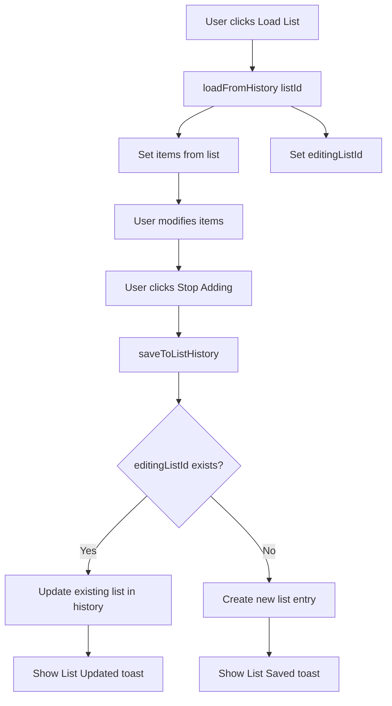

# Plan: Add List IDs and Fix Edit Behavior

## Problem Statement

Currently, when a user edits a shopping list (loads it from history, modifies it, and saves), the application creates a new entry in the history instead of updating the existing list. This happens because lists don't have unique identifiers.

## Current Implementation

### Data Structure

- `history: ShoppingItem[][]` - Array of shopping lists (arrays of items)
- Lists are stored as simple arrays without metadata
- No way to identify which list is being edited

### Save Flow

```typescript
const saveToListHistory = () => {
  if (items.length > 0) {
    setHistory((prev) => [items, ...prev.slice(0, 9)]); // Always creates new entry
  }
};
```

### Load Flow

```typescript
const loadFromHistory = (index: number) => {
  const list = history[index];
  if (list) {
    setItems(list); // Just loads items, no tracking of source
  }
};
```

## Solution Overview

Add unique IDs and timestamps to shopping lists, track which list is currently being edited, and update the existing list when saving instead of creating a new one.

## Implementation Steps

### 1. Create New Type for Saved Lists

**File:** `src/types/shopping.ts` (new file)

```typescript
import { type ShoppingItem } from "@/components/ShoppingList";

export interface SavedList {
  id: string; // Unique identifier (UUID or timestamp-based)
  items: ShoppingItem[]; // The shopping items
  createdAt: number; // Timestamp when list was created
  updatedAt: number; // Timestamp when list was last modified
}
```

### 2. Update History State

**File:** `src/components/GroceryApp.tsx`

```typescript
// Change from:
const [history, setHistory] = useState<ShoppingItem[][]>([]);

// To:
const [history, setHistory] = useState<SavedList[]>([]);
```

### 3. Add State to Track Editing List

**File:** `src/components/GroceryApp.tsx`

```typescript
// Track which list is currently being edited (null = new list)
const [editingListId, setEditingListId] = useState<string | null>(null);
```

### 4. Update saveToListHistory Function

**File:** `src/components/GroceryApp.tsx`

```typescript
const saveToListHistory = () => {
  if (items.length > 0) {
    const now = Date.now();

    if (editingListId) {
      // Update existing list
      setHistory((prev) =>
        prev.map((list) =>
          list.id === editingListId
            ? { ...list, items: [...items], updatedAt: now }
            : list
        )
      );
      toast({
        title: "List Updated",
        description: "Your shopping list has been updated.",
      });
    } else {
      // Create new list
      const newList: SavedList = {
        id: generateId(), // Helper function to create unique ID
        items: [...items],
        createdAt: now,
        updatedAt: now,
      };
      setHistory((prev) => [newList, ...prev.slice(0, 9)]);
      toast({
        title: "List Saved",
        description: "Your shopping list has been saved to history.",
      });
    }
  }
};
```

### 5. Update loadFromHistory Function

**File:** `src/components/GroceryApp.tsx`

```typescript
const loadFromHistory = (listId: string) => {
  const list = history.find((l) => l.id === listId);
  if (list) {
    setItems(list.items);
    setEditingListId(listId); // Track that we're editing this list
    setActiveTab("current"); // Switch to current list tab
    toast({
      title: "List Loaded",
      description: "Shopping list loaded from history.",
    });
  }
};
```

### 6. Update deleteList Function

**File:** `src/components/GroceryApp.tsx`

```typescript
const deleteList = (listId: string) => {
  setHistory((prev) => prev.filter((list) => list.id !== listId));

  // If we deleted the list we were editing, clear the editing state
  if (editingListId === listId) {
    setEditingListId(null);
  }

  toast({
    title: "List Deleted",
    description: "Shopping list has been removed from history.",
  });
};
```

### 7. Update clearList Function

**File:** `src/components/GroceryApp.tsx`

```typescript
const handleClearList = () => {
  // Stop any active microphones first
  if (mode === "adding") {
    addItemsRecognition.stopListening();
  } else if (mode === "shopping") {
    shoppingRecognition.stopListening();
  }

  // Update the state
  setItems([]);
  setHasStartedShopping(false);
  setMode("idle");
  setEditingListId(null); // Clear editing state when clearing list

  // Explicitly clear localStorage to ensure data is removed
  localStorage.removeItem("voice-shopper-current-list");
};
```

### 8. Update Storage Functions

**File:** `src/lib/storage.ts`

```typescript
import { type SavedList } from "@/types/shopping";

// Update saveHistory
export const saveHistory = (history: SavedList[]): void => {
  try {
    localStorage.setItem(STORAGE_KEYS.HISTORY, JSON.stringify(history));
  } catch (error) {
    console.error("Failed to save history to localStorage:", error);
  }
};

// Update loadHistory
export const loadHistory = (): SavedList[] | null => {
  try {
    const stored = localStorage.getItem(STORAGE_KEYS.HISTORY);
    if (stored) {
      const parsed = JSON.parse(stored);

      // Migration: Handle old format (ShoppingItem[][]) and convert to SavedList[]
      if (Array.isArray(parsed) && parsed.length > 0) {
        // Check if first element is a SavedList (has id property)
        if ("id" in parsed[0]) {
          return parsed as SavedList[];
        } else {
          // Migrate old format to new format
          const migrated: SavedList[] = parsed.map(
            (items: ShoppingItem[], index: number) => ({
              id: `migrated-${Date.now()}-${index}`,
              items: items,
              createdAt: Date.now() - index * 1000, // Stagger timestamps
              updatedAt: Date.now(),
            })
          );
          // Save migrated data
          localStorage.setItem(STORAGE_KEYS.HISTORY, JSON.stringify(migrated));
          return migrated;
        }
      }
    }
  } catch (error) {
    console.error("Failed to load history from localStorage:", error);
  }
  return null;
};
```

### 9. Update HistoryTab Component

**File:** `src/components/HistoryTab.tsx`

```typescript
import { type SavedList } from "@/types/shopping";

interface HistoryTabProps {
  history: SavedList[];
  onLoadList: (listId: string) => void;
  onClearHistory: () => void;
  onDeleteList: (listId: string) => void;
}

export const HistoryTab: React.FC<HistoryTabProps> = ({
  history,
  onLoadList,
  onClearHistory,
  onDeleteList,
}) => {
  const formatDate = (timestamp: number) => {
    const date = new Date(timestamp);
    const now = new Date();
    const diffMs = now.getTime() - date.getTime();
    const diffMins = Math.floor(diffMs / 60000);
    const diffHours = Math.floor(diffMs / 3600000);
    const diffDays = Math.floor(diffMs / 86400000);

    if (diffMins < 1) return "Just now";
    if (diffMins < 60) return `${diffMins}m ago`;
    if (diffHours < 24) return `${diffHours}h ago`;
    if (diffDays < 7) return `${diffDays}d ago`;
    return date.toLocaleDateString();
  };

  const getItemPreview = (items: ShoppingItem[]) => {
    const previewItems = items.slice(0, 3);
    const preview = previewItems.map((item) => item.name).join(", ");
    const remaining = items.length - previewItems.length;
    return remaining > 0 ? `${preview} +${remaining} more` : preview;
  };

  return (
    <Card className="p-4 md:p-6 lg:p-8 shadow-card rounded-xl md:rounded-2xl border-0 bg-white/80 backdrop-blur-sm">
      {/* ... header ... */}

      {history.length === 0 ? (
        {
          /* ... empty state ... */
        }
      ) : (
        <div className="space-y-2 md:space-y-3 max-h-96 overflow-y-auto pr-1 md:pr-2">
          {history.map((list) => (
            <div
              key={list.id}
              className="group relative p-3 md:p-4 bg-muted/50 rounded-xl hover:bg-muted transition-all duration-300 border hover:border-primary/30"
            >
              <div className="flex items-start justify-between gap-3">
                <div
                  className="flex-1 min-w-0 cursor-pointer"
                  onClick={() => onLoadList(list.id)}
                >
                  <div className="flex items-center gap-2 mb-1">
                    <div className="w-2 h-2 rounded-full bg-primary flex-shrink-0"></div>
                    <span className="font-semibold text-sm md:text-base">
                      {list.items.length} item
                      {list.items.length !== 1 ? "s" : ""}
                    </span>
                  </div>
                  <p className="text-xs md:text-sm text-muted-foreground truncate mb-1">
                    {getItemPreview(list.items)}
                  </p>
                  <div className="flex items-center gap-1 text-xs text-muted-foreground">
                    <Clock className="w-3 h-3" />
                    <span>{formatDate(list.updatedAt)}</span>
                  </div>
                </div>
                <Button
                  onClick={(e) => {
                    e.stopPropagation();
                    onDeleteList(list.id);
                  }}
                  variant="ghost"
                  size="sm"
                  className="opacity-0 group-hover:opacity-100 transition-opacity text-muted-foreground hover:text-destructive hover:bg-destructive/10 p-1 h-8 w-8 flex-shrink-0"
                  aria-label={`Delete list with ${list.items.length} items`}
                >
                  <Trash2 className="w-4 h-4" />
                </Button>
              </div>
            </div>
          ))}
        </div>
      )}
    </Card>
  );
};
```

### 10. Add Helper Function for ID Generation

**File:** `src/lib/utils.ts` or create new `src/lib/id.ts`

```typescript
/**
 * Generate a unique ID for shopping lists
 * Uses timestamp + random string for uniqueness
 */
export const generateId = (): string => {
  return `${Date.now()}-${Math.random().toString(36).substr(2, 9)}`;
};
```

## Data Flow Diagram



## Migration Strategy

The implementation includes automatic migration from the old format (`ShoppingItem[][]`) to the new format (`SavedList[]`). This happens in the `loadHistory` function:

1. Check if loaded data has `id` property (new format)
2. If not, it's old format - migrate to new format
3. Assign unique IDs and timestamps to migrated lists
4. Save migrated data back to localStorage
5. Return migrated data

## Testing Checklist

- [ ] Create a new list and save it - should create new entry with ID
- [ ] Load a list from history - should set editingListId
- [ ] Modify loaded list and save - should update existing entry, not create new one
- [ ] Create a new list after editing - should create new entry (editingListId = null)
- [ ] Delete a list - should remove from history and clear editingListId if needed
- [ ] Clear current list - should clear editingListId
- [ ] Migration from old format works correctly
- [ ] Timestamps display correctly in HistoryTab
- [ ] History persists across page refreshes

## Files to Modify

1. **New:** `src/types/shopping.ts` - Define SavedList interface
2. **Modify:** `src/components/GroceryApp.tsx` - Update state and functions
3. **Modify:** `src/components/HistoryTab.tsx` - Update to use SavedList type
4. **Modify:** `src/lib/storage.ts` - Update storage functions with migration
5. **Modify:** `src/lib/utils.ts` - Add generateId helper function

## Benefits

1. **Proper Edit Behavior:** Editing a list updates the existing entry instead of creating duplicates
2. **Better Tracking:** Timestamps show when lists were created and last modified
3. **Unique Identification:** Each list has a unique ID for reliable operations
4. **Backward Compatible:** Automatic migration from old format
5. **Cleaner History:** No duplicate entries from editing
