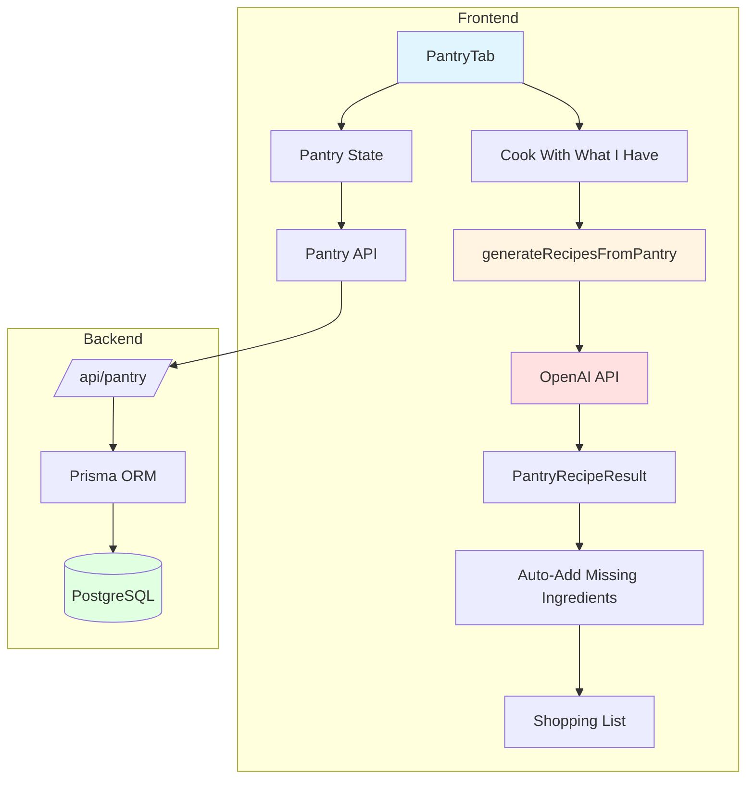
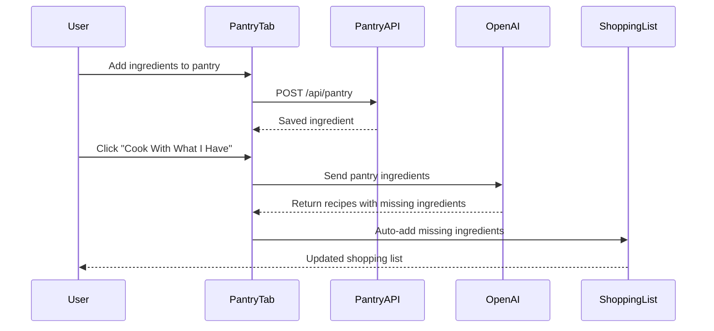

# Pantry-Based Recipe Generator - Implementation Plan

## Overview

This feature transforms SousChefy from a simple recipe finder into an intelligent meal decision engine by allowing users to store pantry ingredients and generate AI-powered recipes based on what they have at home. Missing ingredients are automatically added to the shopping list.

## Architecture Diagram



## Data Flow



## Phase 1: Backend Implementation

### 1.1 Update Prisma Schema

**File**: `backend/prisma/schema.prisma`

Add the Pantry model after the Recipe model:

```prisma
model Pantry {
  id          String   @id @default(cuid())
  userId      String
  user        User     @relation(fields: [userId], references: [id], onDelete: Cascade)
  name        String
  quantity    Float?
  unit        String?
  category    String?  // produce, dairy, protein, etc.
  addedAt     DateTime @default(now())
  expiresAt   DateTime?

  @@index([userId])
  @@index([userId, category])
}
```

Update the User model to include the pantry relation:

```prisma
model User {
  id            String    @id @default(cuid())
  email         String    @unique
  name          String?
  passwordHash  String
  createdAt     DateTime  @default(now())
  updatedAt     DateTime  @updatedAt

  lists         List[]
  recipes       Recipe[]
  pantry        Pantry[]  // Add this line
  preferences   UserPreferences?
  sharedLists   SharedList[] @relation("SharedBy")
  receivedLists SharedList[] @relation("SharedWith")
}
```

### 1.2 Create Pantry API Routes

**File**: `backend/src/routes/pantry.ts`

```typescript
import { Router } from "express";
import { authenticate } from "../middleware/auth";

const router = Router();

// Get all pantry items for user
router.get("/", authenticate, async (req: any, res: any) => {
  try {
    const pantryItems = await req.prisma.pantry.findMany({
      where: { userId: req.user!.id },
      orderBy: [{ category: "asc" }, { name: "asc" }],
      take: 100,
    });
    res.json(pantryItems);
  } catch (error) {
    console.error("Error fetching pantry items:", error);
    res.status(500).json({ error: "Failed to fetch pantry items" });
  }
});

// Add pantry item
router.post("/", authenticate, async (req: any, res: any) => {
  try {
    const { name, quantity, unit, category, expiresAt } = req.body;

    if (!name) {
      return res.status(400).json({ error: "Name is required" });
    }

    const pantryItem = await req.prisma.pantry.create({
      data: {
        userId: req.user!.id,
        name: name.trim(),
        quantity: quantity || null,
        unit: unit || null,
        category: category || null,
        expiresAt: expiresAt ? new Date(expiresAt) : null,
      },
    });

    res.status(201).json(pantryItem);
  } catch (error) {
    console.error("Error creating pantry item:", error);
    res.status(500).json({ error: "Failed to create pantry item" });
  }
});

// Update pantry item
router.put("/:id", authenticate, async (req: any, res: any) => {
  try {
    const { id } = req.params;
    const { name, quantity, unit, category, expiresAt } = req.body;

    // Verify ownership
    const existing = await req.prisma.pantry.findUnique({
      where: { id },
    });

    if (!existing) {
      return res.status(404).json({ error: "Pantry item not found" });
    }

    if (existing.userId !== req.user!.id) {
      return res.status(403).json({ error: "Not authorized" });
    }

    const pantryItem = await req.prisma.pantry.update({
      where: { id },
      data: {
        name: name?.trim() || existing.name,
        quantity: quantity !== undefined ? quantity : existing.quantity,
        unit: unit !== undefined ? unit : existing.unit,
        category: category !== undefined ? category : existing.category,
        expiresAt:
          expiresAt !== undefined
            ? expiresAt
              ? new Date(expiresAt)
              : null
            : existing.expiresAt,
      },
    });

    res.json(pantryItem);
  } catch (error) {
    console.error("Error updating pantry item:", error);
    res.status(500).json({ error: "Failed to update pantry item" });
  }
});

// Delete pantry item
router.delete("/:id", authenticate, async (req: any, res: any) => {
  try {
    const { id } = req.params;

    // Verify ownership
    const existing = await req.prisma.pantry.findUnique({
      where: { id },
    });

    if (!existing) {
      return res.status(404).json({ error: "Pantry item not found" });
    }

    if (existing.userId !== req.user!.id) {
      return res.status(403).json({ error: "Not authorized" });
    }

    await req.prisma.pantry.delete({
      where: { id },
    });

    res.status(204).send();
  } catch (error) {
    console.error("Error deleting pantry item:", error);
    res.status(500).json({ error: "Failed to delete pantry item" });
  }
});

// Clear all pantry items
router.delete("/", authenticate, async (req: any, res: any) => {
  try {
    await req.prisma.pantry.deleteMany({
      where: { userId: req.user!.id },
    });

    res.status(204).send();
  } catch (error) {
    console.error("Error clearing pantry:", error);
    res.status(500).json({ error: "Failed to clear pantry" });
  }
});

export default router;
```

### 1.3 Register Pantry Routes

**File**: `backend/src/index.ts`

Add pantry routes:

```typescript
import pantryRoutes from "./routes/pantry";

// Register routes
app.use("/api/auth", authRoutes);
app.use("/api/lists", listsRoutes);
app.use("/api/recipes", recipesRoutes);
app.use("/api/pantry", pantryRoutes); // Add this line
```

### 1.4 Create Database Migration

Run the following commands to create and apply the migration:

```bash
cd backend
npx prisma migrate dev --name add_pantry_model
npx prisma generate
```

## Phase 2: Frontend Types and API Integration

### 2.1 Create Pantry Types

**File**: `src/types/pantry.ts`

```typescript
export interface PantryItem {
  id: string;
  userId: string;
  name: string;
  quantity?: number | null;
  unit?: string | null;
  category?: string | null;
  addedAt: string;
  expiresAt?: string | null;
}

export interface PantryRecipe {
  id: string;
  name: string;
  description: string;
  ingredientsUsedFromPantry: PantryIngredient[];
  missingIngredients: PantryIngredient[];
  instructions: string[];
  estimatedTime: string;
  difficulty: string;
  pantryCoverage: number; // Percentage of ingredients from pantry
}

export interface PantryIngredient {
  name: string;
  quantity?: string;
  unit?: string;
}

export type PantryCategory =
  | "produce"
  | "dairy"
  | "protein"
  | "grains"
  | "canned"
  | "frozen"
  | "spices"
  | "oils"
  | "condiments"
  | "beverages"
  | "snacks"
  | "baking"
  | "other";
```

### 2.2 Create Pantry API

**File**: `src/lib/pantry-api.ts`

```typescript
import { API_BASE_URL } from "./api";
import type { PantryItem } from "@/types/pantry";

const PANTRY_API_URL = `${API_BASE_URL}/pantry`;

export const pantryApi = {
  // Get all pantry items
  getAll: async (): Promise<PantryItem[]> => {
    const response = await fetch(PANTRY_API_URL, {
      headers: {
        Authorization: `Bearer ${localStorage.getItem("token")}`,
      },
    });

    if (!response.ok) {
      throw new Error("Failed to fetch pantry items");
    }

    return response.json();
  },

  // Add pantry item
  create: async (
    item: Omit<PantryItem, "id" | "userId" | "addedAt">,
  ): Promise<PantryItem> => {
    const response = await fetch(PANTRY_API_URL, {
      method: "POST",
      headers: {
        "Content-Type": "application/json",
        Authorization: `Bearer ${localStorage.getItem("token")}`,
      },
      body: JSON.stringify(item),
    });

    if (!response.ok) {
      throw new Error("Failed to create pantry item");
    }

    return response.json();
  },

  // Update pantry item
  update: async (
    id: string,
    item: Partial<PantryItem>,
  ): Promise<PantryItem> => {
    const response = await fetch(`${PANTRY_API_URL}/${id}`, {
      method: "PUT",
      headers: {
        "Content-Type": "application/json",
        Authorization: `Bearer ${localStorage.getItem("token")}`,
      },
      body: JSON.stringify(item),
    });

    if (!response.ok) {
      throw new Error("Failed to update pantry item");
    }

    return response.json();
  },

  // Delete pantry item
  delete: async (id: string): Promise<void> => {
    const response = await fetch(`${PANTRY_API_URL}/${id}`, {
      method: "DELETE",
      headers: {
        Authorization: `Bearer ${localStorage.getItem("token")}`,
      },
    });

    if (!response.ok) {
      throw new Error("Failed to delete pantry item");
    }
  },

  // Clear all pantry items
  clear: async (): Promise<void> => {
    const response = await fetch(PANTRY_API_URL, {
      method: "DELETE",
      headers: {
        Authorization: `Bearer ${localStorage.getItem("token")}`,
      },
    });

    if (!response.ok) {
      throw new Error("Failed to clear pantry");
    }
  },
};
```

### 2.3 Update OpenAI Integration

**File**: `src/lib/openai.ts`

Add the new function after `recommendRecipesByIngredients`:

```typescript
/**
 * Generate recipes based on pantry ingredients using OpenAI API
 */
export async function generateRecipesFromPantry(
  pantryItems: Array<{ name: string; quantity?: number; unit?: string }>,
  onRecipe?: StreamingRecipeCallback,
): Promise<PantryRecipe[]> {
  if (!OPENAI_API_KEY) {
    throw new Error("OpenAI API key is not configured");
  }

  // Format pantry items for the prompt
  const pantryList = pantryItems
    .map((item) => {
      if (item.quantity && item.unit) {
        return `${item.quantity} ${item.unit} ${item.name}`;
      } else if (item.quantity) {
        return `${item.quantity} ${item.name}`;
      }
      return item.name;
    })
    .join(", ");

  const response = await fetch(OPENAI_API_URL, {
    method: "POST",
    headers: {
      "Content-Type": "application/json",
      Authorization: `Bearer ${OPENAI_API_KEY}`,
    },
    body: JSON.stringify({
      model: "gpt-4o-mini",
      stream: true,
      messages: [
        {
          role: "system",
          content: `You are a smart recipe generator. Generate 5 recipes using primarily the ingredients in the user's pantry.

CRITICAL: You MUST return ONLY valid JSON objects. No conversational text, no explanations, no markdown formatting.

Return each recipe as a separate JSON object on its own line, like this:
{"name": "Recipe Name", "description": "Brief description", "ingredientsUsedFromPantry": [{"name": "ingredient", "quantity": "amount", "unit": "unit"}], "missingIngredients": [{"name": "ingredient", "quantity": "amount", "unit": "unit"}], "instructions": ["Step 1", "Step 2"], "estimatedTime": "30 min", "difficulty": "Easy", "pantryCoverage": 80}
{"name": "Recipe Name 2", "description": "Brief description", "ingredientsUsedFromPantry": [{"name": "ingredient", "quantity": "amount", "unit": "unit"}], "missingIngredients": [{"name": "ingredient", "quantity": "amount", "unit": "unit"}], "instructions": ["Step 1", "Step 2"], "estimatedTime": "30 min", "difficulty": "Easy", "pantryCoverage": 75}
...

Requirements:
- Generate 5 different recipes using the provided pantry ingredients
- Prioritize recipes that use the MOST pantry ingredients
- Include complete ingredient lists for both pantry and missing items
- Include full cooking instructions
- Include estimated cooking time and difficulty level
- Calculate pantryCoverage as a percentage (0-100) of total ingredients that come from pantry
- Include realistic quantities for missing ingredients
- Return each recipe as a separate JSON object on its own line
- No additional text before or after JSON objects`,
        },
        {
          role: "user",
          content: `Generate 5 recipes using these pantry ingredients: ${pantryList}`,
        },
      ],
      temperature: 0.7,
      max_tokens: 4000,
    }),
  });

  if (!response.ok) {
    const errorText = await response.text();
    throw new Error(`OpenAI API error: ${response.statusText} - ${errorText}`);
  }

  const allRecipes: PantryRecipe[] = [];

  // Stream recipes as they arrive
  for await (const recipes of streamPantryRecipesFromResponse(response)) {
    const recipesWithIds = recipes.map((recipe, index) => ({
      ...recipe,
      id: `pantry-recipe-${Date.now()}-${allRecipes.length + index}`,
    }));

    allRecipes.push(...recipesWithIds);

    if (onRecipe) {
      onRecipe([...allRecipes]);
    }
  }

  return allRecipes;
}

/**
 * Parse streaming response for pantry recipes
 */
async function* streamPantryRecipesFromResponse(
  response: Response,
): AsyncGenerator<PantryRecipe[], void, unknown> {
  const reader = response.body?.getReader();
  if (!reader) {
    throw new Error("Response body is not readable");
  }

  const decoder = new TextDecoder();
  let contentBuffer = "";
  const seenRecipes = new Set<string>();

  try {
    while (true) {
      const { done, value } = await reader.read();
      if (done) break;

      const chunk = decoder.decode(value, { stream: true });

      // Parse SSE (Server-Sent Events) format
      const lines = chunk.split("\n");

      for (const line of lines) {
        if (line.startsWith("data: ")) {
          const data = line.slice(6);

          // Skip [DONE] marker
          if (data === "[DONE]") continue;

          try {
            const parsed = JSON.parse(data);
            const content = parsed.choices?.[0]?.delta?.content;

            if (content) {
              contentBuffer += content;

              // Try to extract JSON objects from accumulated content
              const jsonObjects = extractJSONObjects(contentBuffer);
              if (jsonObjects.length > 0) {
                const validRecipes = jsonObjects.filter((obj) =>
                  isValidPantryRecipe(obj),
                );

                // Filter out recipes we've already sent
                const newRecipes = validRecipes.filter(
                  (recipe: PantryRecipe) => {
                    const recipeKey = `${recipe.name}-${recipe.description}`;
                    if (seenRecipes.has(recipeKey)) {
                      return false;
                    }
                    seenRecipes.add(recipeKey);
                    return true;
                  },
                );

                if (newRecipes.length > 0) {
                  yield newRecipes;
                }
              }
            }
          } catch {
            continue;
          }
        }
      }
    }
  } finally {
    reader.releaseLock();
  }
}

/**
 * Validate that an object is a valid PantryRecipe
 */
function isValidPantryRecipe(obj: any): obj is PantryRecipe {
  return (
    typeof obj === "object" &&
    obj !== null &&
    typeof obj.name === "string" &&
    obj.name.trim().length > 0 &&
    typeof obj.description === "string" &&
    Array.isArray(obj.ingredientsUsedFromPantry) &&
    Array.isArray(obj.missingIngredients) &&
    Array.isArray(obj.instructions) &&
    typeof obj.estimatedTime === "string" &&
    typeof obj.difficulty === "string" &&
    typeof obj.pantryCoverage === "number" &&
    obj.pantryCoverage >= 0 &&
    obj.pantryCoverage <= 100
  );
}
```

## Phase 3: Frontend Components

### 3.1 Create PantryTab Component

**File**: `src/components/PantryTab.tsx`

```typescript
import React, { useState, useEffect, useCallback } from 'react';
import { Button } from './ui/button';
import { Input } from './ui/input';
import { Card } from './ui/card';
import { Badge } from './ui/badge';
import { ScrollArea } from './ui/scroll-area';
import { Trash2, Edit2, Plus, ChefHat, CheckCircle2 } from 'lucide-react';
import { useToast } from '@/hooks/use-toast';
import { pantryApi } from '@/lib/pantry-api';
import { generateRecipesFromPantry } from '@/lib/openai';
import { type PantryItem, type PantryRecipe, type PantryCategory } from '@/types/pantry';
import { type ShoppingItem } from './ShoppingList';
import { cn, findBestMatch } from '@/lib/utils';

const CATEGORIES: { value: PantryCategory; label: string }[] = [
  { value: 'produce', label: 'Produce' },
  { value: 'dairy', label: 'Dairy' },
  { value: 'protein', label: 'Protein' },
  { value: 'grains', label: 'Grains' },
  { value: 'canned', label: 'Canned' },
  { value: 'frozen', label: 'Frozen' },
  { value: 'spices', label: 'Spices' },
  { value: 'oils', label: 'Oils' },
  { value: 'condiments', label: 'Condiments' },
  { value: 'beverages', label: 'Beverages' },
  { value: 'snacks', label: 'Snacks' },
  { value: 'baking', label: 'Baking' },
  { value: 'other', label: 'Other' },
];

interface PantryTabProps {
  onAddMissingIngredients: (ingredients: ShoppingItem[]) => void;
}

export const PantryTab: React.FC<PantryTabProps> = ({ onAddMissingIngredients }) => {
  const [pantryItems, setPantryItems] = useState<PantryItem[]>([]);
  const [generatedRecipes, setGeneratedRecipes] = useState<PantryRecipe[]>([]);
  const [isGenerating, setIsGenerating] = useState(false);
  const [isAdding, setIsAdding] = useState(false);
  const [editingItem, setEditingItem] = useState<string | null>(null);
  const [newItemName, setNewItemName] = useState('');
  const [newItemQuantity, setNewItemQuantity] = useState('');
  const [newItemUnit, setNewItemUnit] = useState('');
  const [newItemCategory, setNewItemCategory] = useState<PantryCategory>('other');
  const { toast } = useToast();

  // Load pantry items on mount
  useEffect(() => {
    loadPantryItems();
  }, []);

  const loadPantryItems = async () => {
    try {
      const items = await pantryApi.getAll();
      setPantryItems(items);
    } catch (error) {
      console.error('Failed to load pantry items:', error);
      toast({
        title: 'Error',
        description: 'Failed to load pantry items',
        variant: 'destructive',
      });
    }
  };

  const handleAddItem = async () => {
    if (!newItemName.trim()) {
      toast({
        title: 'Error',
        description: 'Please enter an ingredient name',
        variant: 'destructive',
      });
      return;
    }

    setIsAdding(true);
    try {
      const quantity = newItemQuantity ? parseFloat(newItemQuantity) : undefined;
      const unit = newItemUnit || undefined;

      await pantryApi.create({
        name: newItemName.trim(),
        quantity: quantity || null,
        unit: unit || null,
        category: newItemCategory,
      });

      setNewItemName('');
      setNewItemQuantity('');
      setNewItemUnit('');
      setNewItemCategory('other');

      toast({
        title: 'Added',
        description: `${newItemName} added to pantry`,
      });

      await loadPantryItems();
    } catch (error) {
      console.error('Failed to add pantry item:', error);
      toast({
        title: 'Error',
        description: 'Failed to add ingredient to pantry',
        variant: 'destructive',
      });
    } finally {
      setIsAdding(false);
    }
  };

  const handleDeleteItem = async (id: string) => {
    try {
      await pantryApi.delete(id);
      toast({
        title: 'Deleted',
        description: 'Ingredient removed from pantry',
      });
      await loadPantryItems();
    } catch (error) {
      console.error('Failed to delete pantry item:', error);
      toast({
        title: 'Error',
        description: 'Failed to remove ingredient',
        variant: 'destructive',
      });
    }
  };

  const handleGenerateRecipes = async () => {
    if (pantryItems.length === 0) {
      toast({
        title: 'Empty Pantry',
        description: 'Add some ingredients to your pantry first',
        variant: 'destructive',
      });
      return;
    }

    setIsGenerating(true);
    setGeneratedRecipes([]);

    try {
      const recipes = await generateRecipesFromPantry(
        pantryItems.map(item => ({
          name: item.name,
          quantity: item.quantity || undefined,
          unit: item.unit || undefined,
        })),
        (recipes) => {
          setGeneratedRecipes(recipes);
        }
      );

      setGeneratedRecipes(recipes);

      toast({
        title: 'Recipes Generated',
        description: `Found ${recipes.length} recipes using your pantry`,
      });
    } catch (error) {
      console.error('Failed to generate recipes:', error);
      toast({
        title: 'Error',
        description: 'Failed to generate recipes. Please try again.',
        variant: 'destructive',
      });
    } finally {
      setIsGenerating(false);
    }
  };

  const handleAddMissingIngredients = (recipe: PantryRecipe) => {
    const missingIngredients: ShoppingItem[] = recipe.missingIngredients.map(ing => {
      const bestMatch = findBestMatch(ing.name);
      const displayName = bestMatch || ing.name;

      return {
        id: Math.random().toString(36).substr(2, 9),
        name: displayName.charAt(0).toUpperCase() + displayName.slice(1),
        completed: false,
        quantity: ing.quantity ? parseFloat(ing.quantity) : undefined,
        unit: ing.unit || undefined,
      };
    });

    onAddMissingIngredients(missingIngredients);

    toast({
      title: 'Added to Shopping List',
      description: `${missingIngredients.length} ingredients added from "${recipe.name}"`,
    });
  };

  // Group items by category
  const groupedItems = CATEGORIES.reduce((acc, category) => {
    acc[category.value] = pantryItems.filter(item => item.category === category.value);
    return acc;
  }, {} as Record<PantryCategory, PantryItem[]>);

  return (
    <div className="space-y-4">
      {/* Header */}
      <div className="text-center">
        <p className="text-lg md:text-xl font-semibold text-muted-foreground">
          My Pantry
        </p>
        <p className="text-sm text-muted-foreground mt-1">
          {pantryItems.length} ingredient{pantryItems.length !== 1 ? 's' : ''} in stock
        </p>
      </div>

      {/* Add Ingredient Form */}
      <Card className="p-4 md:p-6 shadow-card rounded-xl md:rounded-2xl border-0 bg-white/80 backdrop-blur-sm">
        <div className="space-y-3">
          <Input
            type="text"
            placeholder="Ingredient name..."
            value={newItemName}
            onChange={(e) => setNewItemName(e.target.value)}
            onKeyDown={(e) => {
              if (e.key === 'Enter') {
                handleAddItem();
              }
            }}
            className="h-10 md:h-12 text-sm"
          />
          <div className="flex gap-2">
            <Input
              type="number"
              placeholder="Qty"
              value={newItemQuantity}
              onChange={(e) => setNewItemQuantity(e.target.value)}
              className="h-10 md:h-12 w-24 md:w-28 text-sm"
            />
            <Input
              type="text"
              placeholder="Unit"
              value={newItemUnit}
              onChange={(e) => setNewItemUnit(e.target.value)}
              className="h-10 md:h-12 w-24 md:w-28 text-sm"
            />
            <select
              value={newItemCategory}
              onChange={(e) => setNewItemCategory(e.target.value as PantryCategory)}
              className="h-10 md:h-12 flex-1 text-sm border-2 border-gray-300 rounded-md px-3 bg-white focus:ring-2 focus:ring-gray-400 focus:border-gray-400"
            >
              {CATEGORIES.map(cat => (
                <option key={cat.value} value={cat.value}>
                  {cat.label}
                </option>
              ))}
            </select>
          </div>
          <Button
            onClick={handleAddItem}
            disabled={isAdding || !newItemName.trim()}
            className="w-full h-10 md:h-12"
          >
            <Plus className="w-4 h-4 mr-2" />
            Add to Pantry
          </Button>
        </div>
      </Card>

      {/* Generate Recipes Button */}
      {pantryItems.length > 0 && generatedRecipes.length === 0 && (
        <div className="flex justify-center">
          <Button
            onClick={handleGenerateRecipes}
            disabled={isGenerating}
            size="lg"
            className="px-8 py-3 md:py-3 text-white rounded-full shadow-lg hover:shadow-xl transition-all font-medium bg-gradient-to-r from-orange-500 to-red-500 hover:from-orange-600 hover:to-red-600 min-h-[48px] md:min-h-0"
          >
            <ChefHat className="w-5 h-5 mr-2" />
            {isGenerating ? 'Generating Recipes...' : 'Cook With What I Have'}
          </Button>
        </div>
      )}

      {/* Generated Recipes */}
      {generatedRecipes.length > 0 && (
        <div className="space-y-4">
          <div className="flex items-center justify-between">
            <h3 className="text-lg font-semibold">Recipe Suggestions</h3>
            <Button
              variant="ghost"
              size="sm"
              onClick={() => setGeneratedRecipes([])}
            >
              Clear
            </Button>
          </div>
          <ScrollArea className="h-[400px]">
            <div className="space-y-3">
              {generatedRecipes.map((recipe) => (
                <Card
                  key={recipe.id}
                  className="p-4 shadow-card rounded-xl border-0 bg-white/80 backdrop-blur-sm"
                >
                  <div className="space-y-3">
                    {/* Recipe Header */}
                    <div className="flex items-start justify-between">
                      <div className="flex-1">
                        <h4 className="font-semibold text-lg">{recipe.name}</h4>
                        <p className="text-sm text-muted-foreground mt-1">
                          {recipe.description}
                        </p>
                      </div>
                      <Badge
                        variant="secondary"
                        className={cn(
                          'ml-2',
                          recipe.pantryCoverage >= 80 && 'bg-green-100 text-green-800',
                          recipe.pantryCoverage >= 50 && recipe.pantryCoverage < 80 && 'bg-yellow-100 text-yellow-800',
                          recipe.pantryCoverage < 50 && 'bg-red-100 text-red-800'
                        )}
                      >
                        {recipe.pantryCoverage}% pantry
                      </Badge>
                    </div>

                    {/* Recipe Details */}
                    <div className="flex items-center gap-4 text-sm text-muted-foreground">
                      <span>⏱️ {recipe.estimatedTime}</span>
                      <span>📊 {recipe.difficulty}</span>
                    </div>

                    {/* Ingredients */}
                    <div className="space-y-2">
                      <div className="text-sm font-medium">
                        From Pantry ({recipe.ingredientsUsedFromPantry.length}):
                      </div>
                      <div className="flex flex-wrap gap-1">
                        {recipe.ingredientsUsedFromPantry.map((ing, idx) => (
                          <Badge key={idx} variant="outline" className="text-xs">
                            {ing.quantity && `${ing.quantity} `}
                            {ing.unit && `${ing.unit} `}
                            {ing.name}
                          </Badge>
                        ))}
                      </div>
                    </div>

                    {recipe.missingIngredients.length > 0 && (
                      <div className="space-y-2">
                        <div className="text-sm font-medium text-red-600">
                          Missing ({recipe.missingIngredients.length}):
                        </div>
                        <div className="flex flex-wrap gap-1">
                          {recipe.missingIngredients.map((ing, idx) => (
                            <Badge key={idx} variant="destructive" className="text-xs">
                              {ing.quantity && `${ing.quantity} `}
                              {ing.unit && `${ing.unit} `}
                              {ing.name}
                            </Badge>
                          ))}
                        </div>
                      </div>
                    )}

                    {/* Action Buttons */}
                    <div className="flex gap-2">
                      {recipe.missingIngredients.length > 0 && (
                        <Button
                          onClick={() => handleAddMissingIngredients(recipe)}
                          size="sm"
                          className="flex-1"
                        >
                          <CheckCircle2 className="w-4 h-4 mr-2" />
                          Add Missing to List
                        </Button>
                      )}
                      <Button
                        variant="outline"
                        size="sm"
                        onClick={() => {
                          // View full recipe details
                          toast({
                            title: 'Recipe Details',
                            description: 'Full recipe view coming soon!',
                          });
                        }}
                      >
                        View Recipe
                      </Button>
                    </div>
                  </div>
                </Card>
              ))}
            </div>
          </ScrollArea>
        </div>
      )}

      {/* Pantry Items List */}
      {generatedRecipes.length === 0 && (
        <ScrollArea className="h-[500px]">
          <div className="space-y-3">
            {CATEGORIES.map((category) => {
              const items = groupedItems[category.value];
              if (items.length === 0) return null;

              return (
                <div key={category.value} className="space-y-2">
                  <h3 className="text-sm font-semibold text-muted-foreground uppercase tracking-wide">
                    {category.label}
                  </h3>
                  <div className="space-y-2">
                    {items.map((item) => (
                      <Card
                        key={item.id}
                        className="p-3 shadow-card rounded-lg border-0 bg-white/80 backdrop-blur-sm"
                      >
                        <div className="flex items-center justify-between">
                          <div className="flex-1">
                            <div className="font-medium">{item.name}</div>
                            {(item.quantity || item.unit) && (
                              <div className="text-sm text-muted-foreground">
                                {item.quantity && `${item.quantity} `}
                                {item.unit && item.unit}
                              </div>
                            )}
                          </div>
                          <Button
                            variant="ghost"
                            size="sm"
                            onClick={() => handleDeleteItem(item.id)}
                          >
                            <Trash2 className="w-4 h-4 text-red-500" />
                          </Button>
                        </div>
                      </Card>
                    ))}
                  </div>
                </div>
              );
            })}

            {pantryItems.length === 0 && (
              <div className="text-center py-12 text-muted-foreground">
                <ChefHat className="w-16 h-16 mx-auto mb-4 opacity-50" />
                <p className="text-lg font-medium">Your pantry is empty</p>
                <p className="text-sm mt-2">
                  Add ingredients to get started with recipe suggestions
                </p>
              </div>
            )}
          </div>
        </ScrollArea>
      )}
    </div>
  );
};
```

### 3.2 Update BottomNavigation

**File**: `src/components/BottomNavigation.tsx`

Add 'pantry' to ViewType and update the navigation items:

```typescript
export type ViewType = 'home' | 'search' | 'cooking' | 'favorites' | 'pantry';

// In the component, add pantry navigation item:
{
  value: 'pantry',
  label: 'Pantry',
  icon: Package,
}
```

### 3.3 Update GroceryApp

**File**: `src/components/GroceryApp.tsx`

Add pantry state and handlers:

```typescript
// Add import
import { PantryTab } from './PantryTab';

// Add state
const [pantryItems, setPantryItems] = useState<PantryItem[]>([]);

// Add handler for missing ingredients
const handleAddMissingIngredients = useCallback((ingredients: ShoppingItem[]) => {
  setItems(prevItems => {
    const itemsToAdd = ingredients.filter(newItem =>
      !prevItems.some(existing => existing.name.toLowerCase() === newItem.name.toLowerCase())
    );

    if (itemsToAdd.length > 0) {
      setTimeout(() => {
        toast({
          title: `Added ${itemsToAdd.length} item${itemsToAdd.length > 1 ? "s" : ""}`,
          description: itemsToAdd.map(item =>
            item.quantity ? `${item.quantity}x ${item.name}` : item.name
          ).join(", "),
        });
      }, 0);
    }

    return [...prevItems, ...itemsToAdd];
  });

  // Switch to home view
  setActiveView('home');
}, [toast]);

// Add pantry view to render
{activeView === 'pantry' && (
  <div className="space-y-4 animate-fade-in">
    <PantryTab onAddMissingIngredients={handleAddMissingIngredients} />
  </div>
)}
```

## Phase 4: Testing and Polish

### 4.1 Testing Checklist

- [ ] Add pantry item successfully saves to database
- [ ] Pantry items load correctly on page refresh
- [ ] Edit pantry item updates correctly
- [ ] Delete pantry item removes from database
- [ ] Clear all pantry items works correctly
- [ ] "Cook With What I Have" generates recipes
- [ ] Generated recipes show correct pantry coverage
- [ ] Missing ingredients are identified correctly
- [ ] "Add Missing to List" adds ingredients to shopping list
- [ ] Duplicate ingredients are not added to shopping list
- [ ] Mobile responsive design works correctly
- [ ] Loading states display properly
- [ ] Error handling works for API failures
- [ ] Toast notifications provide clear feedback

### 4.2 Performance Considerations

- Pantry items are cached in state to reduce API calls
- Recipe generation uses streaming for better UX
- Pantry coverage calculation is done by AI, not client-side
- Missing ingredient deduplication prevents duplicates in shopping list

### 4.3 Future Enhancements

- Pantry expiration tracking with AI warnings
- Photo recognition for adding ingredients
- Receipt scanning for automatic pantry updates
- Nutritional information for pantry items
- Weekly meal planning based on pantry
- Pantry sharing between family members
- Smart shopping suggestions based on pantry usage patterns

## Success Metrics

- **Pantry Engagement Rate**: % of users who add items to pantry
- **Recipe Generation Rate**: % of pantry users who generate recipes
- **Missing Ingredient Add Rate**: % of generated recipes where missing ingredients are added to shopping list
- **Pantry Coverage Average**: Average % of ingredients from pantry in generated recipes
- **Weekly Active Usage**: % of users who use pantry feature weekly

## Deployment Checklist

1. [ ] Backend migration applied to production database
2. [ ] Backend API routes deployed
3. [ ] Frontend code deployed
4. [ ] OpenAI API key configured
5. [ ] Database connection tested
6. [ ] End-to-end testing completed
7. [ ] Mobile responsiveness verified
8. [ ] Error monitoring configured
9. [ ] Analytics tracking implemented
10. [ ] Documentation updated
