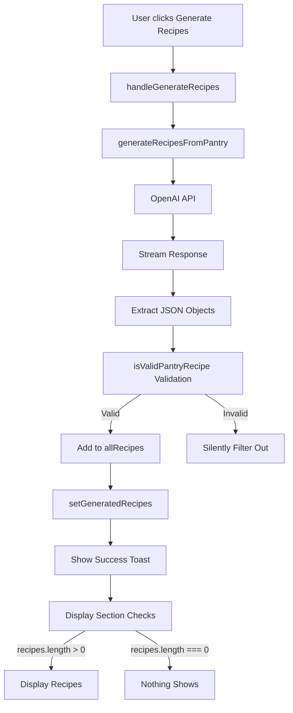

# Pantry Recipe Display Fix - Implementation Plan

## Problem Analysis

When users click "Generate Recipes from Pantry", the toast shows "Recipes Generated" but no recipes are displayed. After analyzing the code, I've identified the root causes:

### Root Causes

1. **Validation Failure**: The `isValidPantryRecipe` function in `openai.ts` is too strict. If AI returns recipes that don't exactly match the expected structure, they're filtered out and never displayed.

2. **Silent Failures**: The toast shows success even when `recipes` array is empty or contains only invalid recipes.

3. **No Fallback UI**: When recipe generation fails or returns invalid data, there's no user-facing explanation or retry mechanism.

4. **Limited Error Context**: Users don't see why recipes aren't displaying (API error, validation error, or empty results).

## Architecture Diagram



## Implementation Plan

### Phase 1: Add Diagnostic Logging

**File**: `src/lib/openai.ts`

Add comprehensive logging to track recipe generation:

```typescript
// In streamPantryRecipesFromResponse function
async function* streamPantryRecipesFromResponse(
  response: Response,
): AsyncGenerator<PantryRecipe[], void, unknown> {
  const reader = response.body?.getReader();
  if (!reader) {
    throw new Error("Response body is not readable");
  }

  const decoder = new TextDecoder();
  let contentBuffer = "";
  const seenRecipes = new Set<string>();
  let totalObjectsFound = 0;
  let validObjectsFound = 0;
  let invalidObjectsFound = 0;

  try {
    while (true) {
      const { done, value } = await reader.read();
      if (done) break;

      const chunk = decoder.decode(value, { stream: true });
      const lines = chunk.split("\n");

      for (const line of lines) {
        if (line.startsWith("data: ")) {
          const data = line.slice(6);

          if (data === "[DONE]") continue;

          try {
            const parsed = JSON.parse(data);
            const content = parsed.choices?.[0]?.delta?.content;

            if (content) {
              contentBuffer += content;

              const jsonObjects = extractJSONObjects(contentBuffer);
              if (jsonObjects.length > 0) {
                totalObjectsFound += jsonObjects.length;

                const validRecipes = jsonObjects.filter((obj) => {
                  const isValid = isValidPantryRecipe(obj);
                  if (!isValid) {
                    invalidObjectsFound++;
                    console.log("[Pantry Recipe Validation Failed]", {
                      object: obj,
                      reason: "Does not match PantryRecipe structure",
                    });
                  }
                  return isValid;
                });

                validObjectsFound = validRecipes.length;

                const newRecipes = validRecipes.filter(
                  (recipe: PantryRecipe) => {
                    const recipeKey = `${recipe.name}-${recipe.description}`;
                    if (seenRecipes.has(recipeKey)) {
                      return false;
                    }
                    seenRecipes.add(recipeKey);
                    return true;
                  },
                );

                if (newRecipes.length > 0) {
                  console.log("[Pantry Recipe Stream]", {
                    totalFound: totalObjectsFound,
                    validFound: validObjectsFound,
                    invalidFound: invalidObjectsFound,
                    newRecipes: newRecipes.length,
                    recipeNames: newRecipes.map((r) => r.name),
                  });
                  yield newRecipes;
                }
              }
            }
          } catch (error) {
            console.error("[Pantry Recipe Parse Error]", error);
            continue;
          }
        }
      }
    }
  } finally {
    reader.releaseLock();
    console.log("[Pantry Recipe Generation Complete]", {
      totalObjectsFound,
      validObjectsFound,
      invalidObjectsFound,
      finalRecipes: seenRecipes.size,
    });
  }
}
```

### Phase 2: Improve Error Handling in PantryTab

**File**: `src/components/PantryTab.tsx`

Update `handleGenerateRecipes` function with better error handling:

```typescript
// Add new state
const [recipeGenerationError, setRecipeGenerationError] = useState<
  string | null
>(null);
const [debugInfo, setDebugInfo] = useState<any>(null);

// Update handleGenerateRecipes
const handleGenerateRecipes = useCallback(async () => {
  if (pantryItems.length === 0) {
    toast({
      title: "No Items",
      description: "Add some items to your pantry first.",
      variant: "destructive",
    });
    return;
  }

  setIsGenerating(true);
  setGeneratedRecipes([]);
  setRecipeGenerationError(null);
  setDebugInfo(null);

  try {
    console.log("[Pantry Generation] Starting with items:", pantryItems);

    const recipes = await generateRecipesFromPantry(pantryItems);

    console.log("[Pantry Generation] Received recipes:", recipes);
    console.log("[Pantry Generation] Recipe count:", recipes.length);

    setGeneratedRecipes(recipes);

    if (recipes.length === 0) {
      setRecipeGenerationError(
        "No recipes could be generated. The AI may have returned invalid data. Please try again or add more ingredients to your pantry.",
      );
      toast({
        title: "No Recipes Generated",
        description: "Unable to generate recipes. Please try again.",
        variant: "destructive",
      });
    } else {
      toast({
        title: "Recipes Generated",
        description: `Found ${recipes.length} recipes you can make!`,
      });
    }
  } catch (error: any) {
    console.error("[Pantry Generation] Error:", error);

    const errorMessage = error.message || "Failed to generate recipes.";
    setRecipeGenerationError(errorMessage);

    setDebugInfo({
      pantryItemCount: pantryItems.length,
      pantryItems: pantryItems.map((i) => i.name),
      error: errorMessage,
      timestamp: new Date().toISOString(),
    });

    toast({
      title: "Error",
      description: errorMessage,
      variant: "destructive",
    });
  } finally {
    setIsGenerating(false);
  }
}, [pantryItems, toast]);
```

### Phase 3: Add Fallback UI Component

**File**: `src/components/PantryTab.tsx`

Create a fallback component for when recipes fail to generate:

```typescript
// Add after the "Generated Recipes" section (around line 476)
{recipeGenerationError && (
  <Card className="shadow-card rounded-xl md:rounded-2xl border-0 bg-red-50/50 backdrop-blur-sm">
    <CardContent className="p-6">
      <div className="flex items-start gap-3">
        <AlertCircle className="w-6 h-6 text-red-500 flex-shrink-0 mt-1" />
        <div className="flex-1 space-y-3">
          <div>
            <h3 className="text-lg font-semibold text-red-900">
              Unable to Generate Recipes
            </h3>
            <p className="text-sm text-red-700 mt-1">
              {recipeGenerationError}
            </p>
          </div>

          <div className="space-y-2 text-sm text-red-800">
            <p className="font-medium">Possible reasons:</p>
            <ul className="list-disc list-inside space-y-1 ml-2">
              <li>Not enough ingredients in your pantry</li>
              <li>Ingredients don't form recognizable recipes</li>
              <li>AI service temporarily unavailable</li>
              <li>Invalid data format from AI</li>
            </ul>
          </div>

          <div className="flex gap-2">
            <Button
              onClick={() => {
                setRecipeGenerationError(null);
                setDebugInfo(null);
                handleGenerateRecipes();
              }}
              className="flex-1"
            >
              <RefreshCw className="w-4 h-4 mr-2" />
              Try Again
            </Button>
            <Button
              onClick={() => setRecipeGenerationError(null)}
              variant="outline"
            >
              Dismiss
            </Button>
          </div>

          {debugInfo && (
            <details className="mt-3">
              <summary className="text-xs text-red-600 cursor-pointer hover:text-red-800">
                Debug Information
              </summary>
              <pre className="mt-2 p-3 bg-red-100 rounded text-xs overflow-auto max-h-48">
                {JSON.stringify(debugInfo, null, 2)}
              </pre>
            </details>
          )}
        </div>
      </div>
    </CardContent>
  </Card>
)}
```

### Phase 4: Improve Recipe Validation

**File**: `src/lib/openai.ts`

Make `isValidPantryRecipe` more lenient with detailed error logging:

```typescript
function isValidPantryRecipe(obj: any): obj is PantryRecipe {
  // Check if it's an object
  if (typeof obj !== "object" || obj === null) {
    console.log("[Validation] Not an object:", obj);
    return false;
  }

  // Check required fields with detailed logging
  const checks = [
    { field: "name", value: obj.name, type: "string", required: true },
    {
      field: "description",
      value: obj.description,
      type: "string",
      required: true,
    },
    {
      field: "ingredientsUsedFromPantry",
      value: obj.ingredientsUsedFromPantry,
      type: "array",
      required: true,
    },
    {
      field: "missingIngredients",
      value: obj.missingIngredients,
      type: "array",
      required: true,
    },
    {
      field: "instructions",
      value: obj.instructions,
      type: "array",
      required: true,
    },
    {
      field: "estimatedTime",
      value: obj.estimatedTime,
      type: "string",
      required: true,
    },
    {
      field: "difficulty",
      value: obj.difficulty,
      type: "string",
      required: true,
    },
    {
      field: "pantryCoverage",
      value: obj.pantryCoverage,
      type: "number",
      required: true,
    },
  ];

  for (const check of checks) {
    if (check.required && (check.value === undefined || check.value === null)) {
      console.log(`[Validation] Missing required field: ${check.field}`);
      return false;
    }

    if (check.type === "string" && typeof check.value !== "string") {
      console.log(
        `[Validation] Field ${check.field} is not a string:`,
        typeof check.value,
      );
      return false;
    }

    if (check.type === "array" && !Array.isArray(check.value)) {
      console.log(
        `[Validation] Field ${check.field} is not an array:`,
        typeof check.value,
      );
      return false;
    }

    if (check.type === "number" && typeof check.value !== "number") {
      console.log(
        `[Validation] Field ${check.field} is not a number:`,
        typeof check.value,
      );
      return false;
    }
  }

  // Additional validation for string fields
  if (obj.name.trim().length === 0) {
    console.log("[Validation] Name is empty");
    return false;
  }

  // Validate pantryCoverage range
  if (obj.pantryCoverage < 0 || obj.pantryCoverage > 100) {
    console.log(
      "[Validation] Pantry coverage out of range:",
      obj.pantryCoverage,
    );
    return false;
  }

  // Validate arrays are not empty
  if (
    obj.ingredientsUsedFromPantry.length === 0 &&
    obj.missingIngredients.length === 0
  ) {
    console.log("[Validation] Both ingredient arrays are empty");
    return false;
  }

  if (obj.instructions.length === 0) {
    console.log("[Validation] Instructions array is empty");
    return false;
  }

  return true;
}
```

### Phase 5: Add Loading State During Generation

**File**: `src/components/PantryTab.tsx`

Add a loading indicator while recipes are being generated:

```typescript
// Add after the "Generate Recipes" button (around line 328)
{isGenerating && (
  <Card className="shadow-card rounded-xl md:rounded-2xl border-0 bg-white/80 backdrop-blur-sm">
    <CardContent className="py-8 text-center">
      <Sparkles className="w-12 h-12 mx-auto mb-4 text-primary animate-pulse" />
      <p className="text-lg font-semibold mb-2">
        Generating Recipes...
      </p>
      <p className="text-sm text-muted-foreground">
        Analyzing your pantry ingredients and finding the best recipes
      </p>
    </CardContent>
  </Card>
)}
```

### Phase 6: Improve Recipe Display

**File**: `src/components/PantryTab.tsx`

Enhance the recipe card display to show more details:

```typescript
// Replace the existing recipe card (lines 398-471) with improved version
<Card key={recipe.id} className="border border-border/50 hover:shadow-lg transition-shadow">
  <CardHeader className="pb-3">
    <div className="flex items-start justify-between gap-2">
      <div className="flex-1">
        <CardTitle className="text-base mb-1 flex items-center gap-2">
          {recipe.name}
          {getCoverageBadge(recipe.pantryCoverage)}
        </CardTitle>
        <CardDescription className="text-sm">
          {recipe.description}
        </CardDescription>
      </div>
    </div>
    <div className="flex items-center gap-4 mt-3 text-sm text-muted-foreground">
      <div className="flex items-center gap-1">
        <Clock className="w-4 h-4" />
        {recipe.estimatedTime}
      </div>
      <div className="flex items-center gap-1">
        <ChefHat className="w-4 h-4" />
        {recipe.difficulty}
      </div>
    </div>
  </CardHeader>
  <CardContent className="space-y-3">
    {/* Ingredients from Pantry */}
    {recipe.ingredientsUsedFromPantry.length > 0 && (
      <div className="bg-green-50 rounded-lg p-3">
        <p className="text-sm font-semibold mb-2 text-green-700 flex items-center gap-2">
          <CheckCircle2 className="w-4 h-4" />
          From Your Pantry ({recipe.ingredientsUsedFromPantry.length})
        </p>
        <div className="flex flex-wrap gap-1">
          {recipe.ingredientsUsedFromPantry.map((ing, idx) => (
            <Badge key={idx} variant="secondary" className="text-xs bg-green-100 text-green-800 hover:bg-green-200">
              {ing.name}
              {ing.quantity && ` (${ing.quantity}${ing.unit ? ` ${ing.unit}` : ''})`}
            </Badge>
          ))}
        </div>
      </div>
    )}

    {/* Missing Ingredients */}
    {recipe.missingIngredients.length > 0 && (
      <div className="bg-orange-50 rounded-lg p-3">
        <p className="text-sm font-semibold mb-2 text-orange-700 flex items-center gap-2">
          <AlertCircle className="w-4 h-4" />
          Missing ({recipe.missingIngredients.length})
        </p>
        <div className="flex flex-wrap gap-1">
          {recipe.missingIngredients.map((ing, idx) => (
            <Badge key={idx} variant="outline" className="text-xs border-orange-300 text-orange-700 hover:bg-orange-100">
              {ing.name}
              {ing.quantity && ` (${ing.quantity}${ing.unit ? ` ${ing.unit}` : ''})`}
            </Badge>
          ))}
        </div>
      </div>
    )}

    {/* Instructions Preview */}
    {recipe.instructions.length > 0 && (
      <div className="bg-muted/50 rounded-lg p-3">
        <p className="text-sm font-semibold mb-2 text-muted-700 flex items-center gap-2">
          <BookOpen className="w-4 h-4" />
          Instructions
        </p>
        <ol className="space-y-2 text-sm">
          {recipe.instructions.slice(0, 3).map((instruction, idx) => (
            <li key={idx} className="flex gap-2">
              <span className="flex-shrink-0 w-5 h-5 rounded-full bg-primary text-primary-foreground flex items-center justify-center text-xs font-semibold">
                {idx + 1}
              </span>
              <span className="flex-1 line-clamp-2">{instruction}</span>
            </li>
          ))}
          {recipe.instructions.length > 3 && (
            <li className="text-sm text-muted-foreground italic">
              ...and {recipe.instructions.length - 3} more steps
            </li>
          )}
        </ol>
      </div>
    )}

    {/* Add Missing to List Button */}
    {recipe.missingIngredients.length > 0 && (
      <Button
        onClick={() => handleAddMissingToShoppingList(recipe)}
        className="w-full"
        variant="default"
      >
        <ShoppingCart className="w-4 h-4 mr-2" />
        Add Missing to Shopping List
      </Button>
    )}
  </CardContent>
</Card>
```

## Files to Modify

1. `src/lib/openai.ts` - Add diagnostic logging and improve validation
2. `src/components/PantryTab.tsx` - Add error handling, fallback UI, and improve display

## Testing Checklist

- [ ] Generate recipes with empty pantry - should show error message
- [ ] Generate recipes with 1-2 ingredients - should work or show helpful error
- [ ] Generate recipes with 5+ ingredients - should work and display recipes
- [ ] Check console logs for diagnostic information
- [ ] Verify fallback UI appears when generation fails
- [ ] Test "Try Again" button in fallback UI
- [ ] Verify debug information is displayed when available
- [ ] Test adding missing ingredients to shopping list
- [ ] Verify recipe cards display all information correctly
- [ ] Test on mobile and desktop

## Success Metrics

- **Recipe Generation Success Rate**: % of pantry generations that produce valid recipes
- **Error Clarity**: Users understand why recipes aren't generating
- **Recovery Rate**: % of users who successfully retry after failure
- **Debug Utility**: Developers can diagnose issues from console logs

## Rollback Plan

If changes cause issues, revert to:

1. Original `isValidPantryRecipe` function
2. Original `handleGenerateRecipes` without error state
3. Original recipe display without fallback UI

## Next Steps

After implementing this fix:

1. Test with various pantry configurations
2. Monitor console logs for validation failures
3. Adjust AI prompt if validation failures persist
4. Consider adding recipe quality scoring
5. Add ability to save pantry recipes to recipe collection
