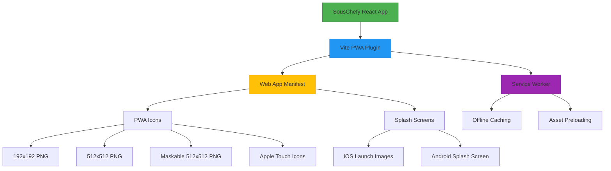

# PWA Implementation Plan for SousChefy

## Architecture Overview



## Implementation Details

### 1. Vite PWA Plugin Configuration

```typescript
// vite.config.ts
import { VitePWA } from "vite-plugin-pwa";

plugins: [
  VitePWA({
    registerType: "autoUpdate",
    includeAssets: ["favicon.ico", "apple-touch-icon.png", "mask-icon.svg"],
    manifest: {
      name: "SousChefy",
      short_name: "SousChefy",
      description: "Voice-controlled grocery shopping application",
      theme_color: "#ffffff",
      background_color: "#ffffff",
      display: "standalone",
      icons: [
        {
          src: "pwa-192x192.png",
          sizes: "192x192",
          type: "image/png",
        },
        {
          src: "pwa-512x512.png",
          sizes: "512x512",
          type: "image/png",
        },
        {
          src: "pwa-512x512.png",
          sizes: "512x512",
          type: "image/png",
          purpose: "any maskable",
        },
      ],
    },
    workbox: {
      globPatterns: ["**/*.{js,css,html,ico,png,svg,woff2}"],
      runtimeCaching: [
        {
          urlPattern: /^https:\/\/.*\.png$/i,
          handler: "CacheFirst",
          options: {
            cacheName: "image-cache",
            expiration: {
              maxEntries: 50,
              maxAgeSeconds: 30 * 24 * 60 * 60, // 30 days
            },
          },
        },
      ],
    },
  }),
];
```

### 2. Web App Manifest Structure

```json
{
  "name": "SousChefy",
  "short_name": "SousChefy",
  "description": "Voice-controlled grocery shopping application",
  "start_url": "/",
  "display": "standalone",
  "background_color": "#ffffff",
  "theme_color": "#ffffff",
  "icons": [
    {
      "src": "pwa-192x192.png",
      "sizes": "192x192",
      "type": "image/png"
    },
    {
      "src": "pwa-512x512.png",
      "sizes": "512x512",
      "type": "image/png"
    },
    {
      "src": "pwa-512x512.png",
      "sizes": "512x512",
      "type": "image/png",
      "purpose": "any maskable"
    },
    {
      "src": "apple-touch-icon.png",
      "sizes": "180x180",
      "type": "image/png"
    }
  ]
}
```

### 3. HTML Meta Tags for PWA

```html
<!-- index.html head section -->
<meta name="viewport" content="width=device-width,initial-scale=1" />
<meta name="theme-color" content="#ffffff" />
<meta name="apple-mobile-web-app-capable" content="yes" />
<meta
  name="apple-mobile-web-app-status-bar-style"
  content="black-translucent"
/>
<link rel="manifest" href="/manifest.json" />
<link rel="icon" href="/favicon.ico" />
<link rel="apple-touch-icon" href="/apple-touch-icon.png" sizes="180x180" />
<link rel="mask-icon" href="/mask-icon.svg" color="#FFFFFF" />

<!-- iOS Splash Screen Meta Tags -->
<link
  rel="apple-touch-startup-image"
  href="/splash/ios-640x1136.png"
  media="(device-width: 320px) and (device-height: 568px) and (-webkit-device-pixel-ratio: 2) and (orientation: portrait)"
/>
<link
  rel="apple-touch-startup-image"
  href="/splash/ios-750x1334.png"
  media="(device-width: 375px) and (device-height: 667px) and (-webkit-device-pixel-ratio: 2) and (orientation: portrait)"
/>
<link
  rel="apple-touch-startup-image"
  href="/splash/ios-1242x2208.png"
  media="(device-width: 414px) and (device-height: 736px) and (-webkit-device-pixel-ratio: 3) and (orientation: portrait)"
/>
<link
  rel="apple-touch-startup-image"
  href="/splash/ios-1125x2436.png"
  media="(device-width: 375px) and (device-height: 812px) and (-webkit-device-pixel-ratio: 3) and (orientation: portrait)"
/>
<link
  rel="apple-touch-startup-image"
  href="/splash/ios-1242x2688.png"
  media="(device-width: 414px) and (device-height: 896px) and (-webkit-device-pixel-ratio: 3) and (orientation: portrait)"
/>
<link
  rel="apple-touch-startup-image"
  href="/splash/ios-828x1792.png"
  media="(device-width: 414px) and (device-height: 896px) and (-webkit-device-pixel-ratio: 2) and (orientation: portrait)"
/>
<link
  rel="apple-touch-startup-image"
  href="/splash/ios-1284x2778.png"
  media="(device-width: 428px) and (device-height: 926px) and (-webkit-device-pixel-ratio: 3) and (orientation: portrait)"
/>
```

### 4. Required Assets

#### PWA Icons

- `pwa-192x192.png` - Standard PWA icon
- `pwa-512x512.png` - High-resolution PWA icon
- `pwa-512x512-maskable.png` - Maskable icon for adaptive icons
- `apple-touch-icon.png` - iOS home screen icon (180x180)
- `mask-icon.svg` - SVG mask icon for Safari

#### iOS Splash Screens

- `ios-640x1136.png` - iPhone 5/SE
- `ios-750x1334.png` - iPhone 6/7/8
- `ios-1242x2208.png` - iPhone 6+/7+/8+
- `ios-1125x2436.png` - iPhone X/XS
- `ios-1242x2688.png` - iPhone XS Max
- `ios-828x1792.png` - iPhone XR
- `ios-1284x2778.png` - iPhone 12/13 Pro Max

### 5. Implementation Steps

1. **Install Dependencies**: Add `vite-plugin-pwa` to package.json
2. **Configure Vite**: Update vite.config.ts with PWA plugin
3. **Create Manifest**: Generate manifest.json with app metadata
4. **Generate Icons**: Create all required icon sizes
5. **Create Splash Screens**: Generate iOS launch images
6. **Update HTML**: Add meta tags and manifest link
7. **Test**: Verify PWA functionality and splash screens

### 6. Testing Requirements

- Test on iOS Safari (iPhone and iPad)
- Test on Android Chrome
- Verify install prompt appears
- Check offline functionality
- Confirm splash screens display correctly
- Test icon appearance on home screen

### 7. Performance Considerations

- Optimize icon sizes for fast loading
- Use proper caching strategies for assets
- Ensure service worker doesn't cache unnecessary files
- Test on slow network connections
