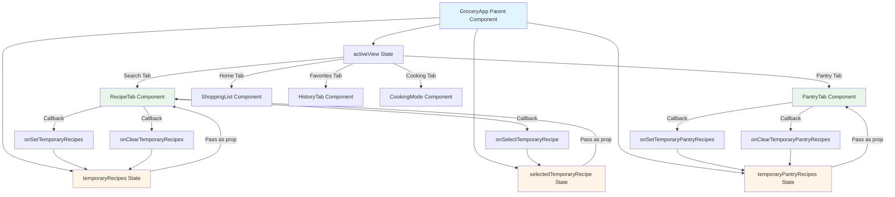

# Temporary Recipe Persistence Across Tab Switches

## Problem Statement

When users search for recipes in the **Search tab** or generate recipes in the **Pantry tab**, the results are stored in local component state. When users switch to another tab, the component unmounts and the search results are lost. Users must re-search or regenerate recipes, which is inefficient and frustrating.

## Current Architecture

### RecipeTab (Search Tab)

- Local state: `recipes`, `selectedRecipe`, `searchQuery`, `searchMode`
- Search results stored in component state
- **Lost when component unmounts** (tab switch)

### PantryTab

- Local state: `generatedRecipes`
- Generated recipes stored in component state
- **Lost when component unmounts** (tab switch)

### GroceryApp

- Manages active view state
- Renders different components based on `activeView`
- No knowledge of temporary recipe search results

## Proposed Solution

Lift temporary recipe state to the parent component ([`GroceryApp`](src/components/GroceryApp.tsx)) so that:

1. Recipe search results persist across tab switches
2. Pantry-generated recipes persist across tab switches
3. Users can switch between tabs without losing generated recipes
4. Results remain active until user decides to clear them or select one

## Architecture Diagram



## State Management in GroceryApp

### New State Variables

```typescript
// Temporary recipes from Search tab
const [temporaryRecipes, setTemporaryRecipes] = useState<Recipe[]>([]);

// Temporary recipes from Pantry tab
const [temporaryPantryRecipes, setTemporaryPantryRecipes] = useState<
  PantryRecipe[]
>([]);

// Selected temporary recipe for viewing details
const [selectedTemporaryRecipe, setSelectedTemporaryRecipe] =
  useState<Recipe | null>(null);
```

### Callback Functions

```typescript
// Update temporary recipes from Search tab
const handleSetTemporaryRecipes = useCallback((recipes: Recipe[]) => {
  setTemporaryRecipes(recipes);
}, []);

// Clear temporary recipes from Search tab
const handleClearTemporaryRecipes = useCallback(() => {
  setTemporaryRecipes([]);
  setSelectedTemporaryRecipe(null);
}, []);

// Update temporary recipes from Pantry tab
const handleSetTemporaryPantryRecipes = useCallback(
  (recipes: PantryRecipe[]) => {
    setTemporaryPantryRecipes(recipes);
  },
  [],
);

// Clear temporary recipes from Pantry tab
const handleClearTemporaryPantryRecipes = useCallback(() => {
  setTemporaryPantryRecipes([]);
}, []);

// Select a temporary recipe for viewing
const handleSelectTemporaryRecipe = useCallback((recipe: Recipe) => {
  setSelectedTemporaryRecipe(recipe);
}, []);
```

## Component Props Changes

### RecipeTab Props

```typescript
export interface RecipeTabProps {
  onAddIngredients: (ingredients: RecipeIngredient[]) => void;
  onSaveRecipe?: (recipe: SavedRecipe) => void;
  isRecipeSaved?: (recipeId: string) => boolean;

  // NEW: Temporary recipe state
  temporaryRecipes?: Recipe[];
  onSetTemporaryRecipes?: (recipes: Recipe[]) => void;
  onClearTemporaryRecipes?: () => void;
  selectedTemporaryRecipe?: Recipe | null;
  onSelectTemporaryRecipe?: (recipe: Recipe) => void;
}
```

### PantryTab Props

```typescript
interface PantryTabProps {
  onAddMissingIngredients: (ingredients: ShoppingItem[]) => void;

  // NEW: Temporary pantry recipe state
  temporaryPantryRecipes?: PantryRecipe[];
  onSetTemporaryPantryRecipes?: (recipes: PantryRecipe[]) => void;
  onClearTemporaryPantryRecipes?: () => void;
}
```

## UI Changes

### RecipeTab - Clear Button

Add a "Clear Results" button when temporary recipes exist:

```tsx
{
  temporaryRecipes && temporaryRecipes.length > 0 && (
    <Button
      onClick={onClearTemporaryRecipes}
      variant="outline"
      className="w-full"
    >
      <X className="w-4 h-4 mr-2" />
      Clear Search Results
    </Button>
  );
}
```

### PantryTab - Clear Button

Add a "Clear Results" button when temporary pantry recipes exist:

```tsx
{
  temporaryPantryRecipes && temporaryPantryRecipes.length > 0 && (
    <Button
      onClick={onClearTemporaryPantryRecipes}
      variant="outline"
      className="w-full"
    >
      <X className="w-4 h-4 mr-2" />
      Clear Generated Recipes
    </Button>
  );
}
```

### Indicator Banner

Add a visual indicator when temporary recipes are active:

```tsx
{
  temporaryRecipes && temporaryRecipes.length > 0 && (
    <div className="bg-blue-50 border border-blue-200 rounded-lg p-3 mb-4">
      <div className="flex items-center justify-between">
        <div className="flex items-center gap-2">
          <Info className="w-4 h-4 text-blue-600" />
          <span className="text-sm text-blue-800">
            {temporaryRecipes.length} recipe
            {temporaryRecipes.length > 1 ? "s" : ""} from search
          </span>
        </div>
        <Button
          onClick={onClearTemporaryRecipes}
          variant="ghost"
          size="sm"
          className="text-blue-600 hover:text-blue-800"
        >
          Clear
        </Button>
      </div>
    </div>
  );
}
```

## Implementation Steps

1. **Update GroceryApp State**
   - Add `temporaryRecipes`, `temporaryPantryRecipes`, `selectedTemporaryRecipe` state variables
   - Add callback functions for updating/clearing temporary recipes

2. **Update RecipeTab Component**
   - Add props for temporary recipe state
   - Modify `handleSearch` to use `onSetTemporaryRecipes` callback
   - Add "Clear Results" button
   - Add indicator banner for temporary recipes
   - Use `temporaryRecipes` prop instead of local `recipes` state

3. **Update PantryTab Component**
   - Add props for temporary pantry recipe state
   - Modify `handleGenerateRecipes` to use `onSetTemporaryPantryRecipes` callback
   - Add "Clear Results" button
   - Use `temporaryPantryRecipes` prop instead of local `generatedRecipes` state

4. **Update GroceryApp Render**
   - Pass temporary recipe state and callbacks to RecipeTab
   - Pass temporary pantry recipe state and callbacks to PantryTab
   - Handle `selectedTemporaryRecipe` display in Search tab

5. **Test Tab Switching**
   - Search for recipes in Search tab
   - Switch to Pantry tab
   - Switch back to Search tab
   - Verify recipes are still visible
   - Test clear button functionality

## Benefits

1. **Improved User Experience**: Users can switch tabs without losing search results
2. **Flexibility**: Users can compare recipes from different sources
3. **Reduced Friction**: No need to re-search or regenerate recipes
4. **Clear Intent**: Clear buttons make it obvious how to dismiss temporary results
5. **State Consistency**: All temporary state managed at parent level

## Edge Cases

1. **Multiple Searches**: New search replaces previous temporary recipes
2. **Empty Results**: Clear button only shows when recipes exist
3. **Recipe Selection**: Selecting a recipe doesn't clear temporary list
4. **Tab Switch**: Temporary recipes persist across all tab switches
5. **Page Refresh**: Temporary recipes are lost (intended behavior)

## Future Enhancements

- Add "Save All" button to save all temporary recipes at once
- Add "Compare" mode to view multiple recipes side-by-side
- Add recipe filtering/sorting for temporary results
- Add timestamp to show when recipes were generated
