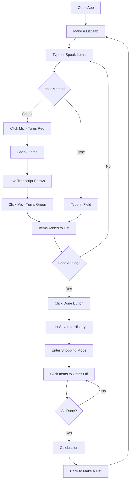

# UX Redesign Plan - Improved Input and Shopping Flow

## Overview

Redesign SousChefy UI to improve user experience with simplified input flow and clearer shopping mode separation.

## Current Issues

1. Complex input mode toggles (Voice/Text buttons)
2. "Start Shopping" button appears in same view as adding items
3. No clear separation between list creation and shopping
4. Input field not always visible
5. Microphone button is separate from input

## New UX Design

### Header

- **Simplified**: Only "SousChefy" text centered
- Remove: Instructions button and spacer elements

### Tab Structure

Two main tabs:

1. **"Make a List"** - For creating and managing shopping lists
2. **"History"** - For viewing and loading saved lists

### "Make a List" Tab Layout

```
┌─────────────────────────────────────────┐
│          SousChefy                │
├─────────────────────────────────────────┤
│                                         │
│           Make a list                   │
│                                         │
│  ┌─────────────────────────────┐       │
│  │ [🎤] Type or speak items  │       │
│  └─────────────────────────────┘       │
│                                         │
│         [ Done ]                        │
│                                         │
│  ┌─────────────────────────────┐       │
│  │  🍎 Apples                │       │
│  │  🍌 Bananas               │       │
│  │  🥛 Milk                  │       │
│  └─────────────────────────────┘       │
│                                         │
└─────────────────────────────────────────┘
```

### Input Field Design

- **Mic icon inside input** (like search box)
- **Mic color states**:
  - Green: Ready to start listening
  - Red: Currently listening
- **Click mic to toggle**: Start/stop voice input
- **Live transcript**: Shows in input field as user speaks
- **Always visible**: Input field always shown, no mode switching needed

### "Done" Button

- **Position**: Below input field
- **Action**:
  1. Save current list to history
  2. Switch to shopping mode (new view)
  3. List becomes read-only for shopping

### Shopping Mode (New Separate View)

```
┌─────────────────────────────────────────┐
│          SousChefy                │
├─────────────────────────────────────────┤
│                                         │
│         Shopping Mode                    │
│                                         │
│  Progress: 1/3 items completed         │
│  ━━━━━━━━━━━━━━━━━━━━━━━━━━━━━━━━  │
│                                         │
│  ┌─────────────────────────────┐       │
│  │  ✅ Apples                │       │
│  │  🍌 Bananas               │       │
│  │  🥛 Milk                  │       │
│  └─────────────────────────────┘       │
│                                         │
│         [ Back to List ]                │
│                                         │
└─────────────────────────────────────────┘
```

### Shopping Mode Features

- **Progress bar**: Shows completed/total items
- **Click to cross off**: User clicks item to toggle completion
- **Visual feedback**: Items show ✅ when completed
- **"Back to List" button**: Returns to editing mode
- **Celebration**: Shows when all items completed

## User Flow



## Implementation Changes

### 1. GroceryApp.tsx - Main Component

#### Remove

- `inputMode` state (voice/text toggle)
- `isTextAdding` state
- Voice/Text toggle buttons
- "Start Shopping" button
- Instructions button (move to separate help section)

#### Add

- `shoppingView` state: 'editing' | 'shopping'
- Input field with inline mic icon
- "Done" button below input
- Shopping mode view (separate from editing)
- Progress bar for shopping mode

#### Modify

- Header: Only show "SousChefy" centered
- Tab structure: "Make a List" and "History"
- Voice recognition: Triggered by inline mic icon
- ShoppingList: Support click-to-cross-off in shopping mode

### 2. ShoppingList.tsx - Update for Shopping Mode

#### Add Props

- `viewMode`: 'editing' | 'shopping'

#### Behavior

- Editing mode: Show remove buttons, allow editing
- Shopping mode: Show as clickable items, click to toggle completion
- Shopping mode: Show progress bar at top

### 3. HistoryTab.tsx - No Changes Needed

- Already works independently
- Just needs to integrate with new tab structure

## Component Structure

```
GroceryApp.tsx
├── Header (Voice Shopper - centered)
├── Tabs
│   ├── Make a List Tab
│   │   ├── Description ("Make a list")
│   │   ├── Input Field (with inline mic)
│   │   │   ├── Mic Icon (green/red toggle)
│   │   │   └── Text Input
│   │   ├── Done Button
│   │   └── ShoppingList (editing mode)
│   │       └── Items with remove buttons
│   └── History Tab
│       └── HistoryTab component
└── Shopping Mode View (when done clicked)
    ├── Shopping Mode Title
    ├── Progress Bar
    ├── ShoppingList (shopping mode)
    │   └── Clickable items
    └── Back to List Button
```

## Key UX Improvements

1. **Simplified Input**: One input field for both typing and speaking
2. **Clear Visual Feedback**: Mic color indicates listening state
3. **Better Separation**: Shopping mode is a distinct view
4. **Progress Tracking**: Visual progress bar in shopping mode
5. **Intuitive Flow**: Make list → Done → Shop → Done
6. **Reduced Cognitive Load**: Fewer buttons and modes

## Migration Notes

### State Changes

- Replace `mode` ('adding' | 'shopping' | 'idle') with:
  - `viewMode`: 'editing' | 'shopping'
  - `isListening`: boolean (for mic icon color)

### Voice Recognition

- Remove dual recognition instances
- Use single instance for adding items
- Triggered by inline mic icon click
- Live transcript displayed in input field

### Shopping Mode

- No longer uses voice recognition
- Pure click-based interaction
- Simpler and more reliable

## Testing Checklist

- [ ] Input field shows mic icon inside
- [ ] Mic icon: green when idle, red when listening
- [ ] Clicking mic toggles voice input on/off
- [ ] Live transcript shows in input field
- [ ] Typing works in same input field
- [ ] Items appear in list below
- [ ] Done button saves to history
- [ ] Done button switches to shopping mode
- [ ] Shopping mode shows progress bar
- [ ] Clicking items in shopping mode crosses them off
- [ ] Back button returns to editing mode
- [ ] History tab works independently
- [ ] All items can be removed in editing mode
- [ ] Celebration shows when shopping complete

## Files to Modify

1. `src/components/GroceryApp.tsx` - Major restructuring
2. `src/components/ShoppingList.tsx` - Add viewMode prop
3. `src/components/HistoryTab.tsx` - No changes (verify integration)

## Files to Keep Unchanged

- `src/hooks/useSpeechRecognition.ts` - May need minor adjustments
- `src/data/groceryItems.ts` - No changes
- `src/lib/storage.ts` - No changes
- `src/types/shopping.ts` - No changes
- All UI components in `src/components/ui/` - No changes
